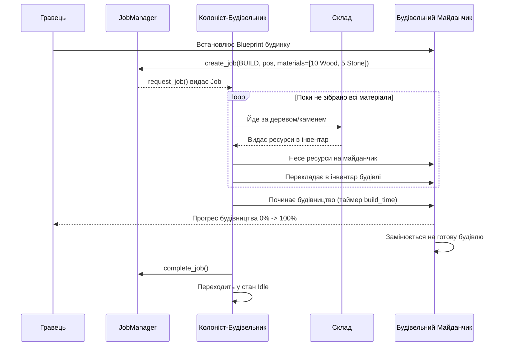

# Skill: Minecolonies-Style Job & Work-Order System

## 1. Опис та Призначення (Overview)
Цей скіл описує архітектуру системи замовлень на роботу (**Job & Work-Order System**), яка є основою геймплею в стилі *Minecolonies* у грі **Saecula**.

### Принцип автономії проти контролю:
* Гравець не керує жителями безпосередньо.
* Гравець або споруди створюють **Завдання (`Job`)**:
  * "Побудувати хатину за кресленням [Blueprint]"
  * "Зрубати позначені дерева [Harvest]"
  * "Принести 20 колод до ратуші [Haul]"
  * "Засіяти та зібрати врожай [Farm]"
* Система `JobManager` шукає відповідного вільного робітника (за професією та відстанню) і призначає йому завдання.
* Робітник самостійно перевіряє необхідні ресурси, бере їх зі складу, йде до місця роботи та виконує її.

---

## 2. Структура завдання (`Job.gd`)

```gdscript
# res://src/systems/jobs/Job.gd
class_name Job
extends RefCounted

enum JobType {
	BUILD,      ## Будівництво за кресленням
	HARVEST,    ## Збір природних ресурсів (дерево, камінь)
	HAUL,       ## Перенесення предметів на склад або майданчик
	CRAFT,      ## Крафт у майстерні
	FARM        ## Обробка полів
}

enum JobStatus {
	PENDING,    ## Очікує вільного робітника
	ASSIGNED,   ## Робітник призначений і виконує завдання
	SUSPENDED,  ## Призупинено (наприклад, не вистачає ресурсів)
	COMPLETED,  ## Успішно завершено
	CANCELLED   ## Скасовано гравцем
}

var id: String = ""
var type: JobType = JobType.BUILD
var status: JobStatus = JobStatus.PENDING
var priority: int = 1 # Більше число = вищий пріоритет

## Координати місця виконання
var target_map_pos: Vector2i = Vector2i.ZERO
var target_world_pos: Vector2 = Vector2.ZERO

## Цільовий об'єкт (будівельний майданчик, дерево, склад тощо)
var target_node: Node = null

## Необхідна професія робітника (порожньо = будь-який вільний житель)
var required_profession: StringName = &""

## Ресурси, потрібні для виконання (якщо це будівництво чи доставка)
var required_items: Array[ItemCost] = []

## Призначений колоніст
var assigned_colonist_id: String = ""

func _init(p_type: JobType, p_pos: Vector2i, p_priority: int = 1) -> void:
	id = ResourceUID.id_to_text(ResourceUID.create_id())
	type = p_type
	target_map_pos = p_pos
	priority = p_priority
```

---

## 3. Глобальний менеджер завдань (`JobManager.gd`)

Менеджер завдань веде облік усіх відкритих робіт та займається їх диспетчеризацією:

```gdscript
# res://src/systems/jobs/JobManager.gd
class_name JobManager
extends Node

signal job_added(job: Job)
signal job_assigned(job: Job, colonist_id: String)
signal job_completed(job: Job)
signal job_cancelled(job: Job)

## Список активних завдань
var _pending_jobs: Array[Job] = []
var _active_jobs: Dictionary = {} # job_id -> Job

## Реєстрація нового завдання у системі
func create_job(type: Job.JobType, map_pos: Vector2i, priority: int = 1, profession: StringName = &"") -> Job:
	var job: Job = Job.new(type, map_pos, priority)
	job.required_profession = profession
	job.target_world_pos = GridManager.map_to_world(map_pos)
	
	_insert_sorted_by_priority(job)
	job_added.emit(job)
	return job

## Запит завдання вільним колоністом
func request_job(colonist_profession: StringName, colonist_pos: Vector2) -> Job:
	var best_index: int = -1
	var best_distance: float = INF
	
	for i in range(_pending_jobs.size()):
		var job: Job = _pending_jobs[i]
		
		# Перевірка сумісності професії
		if job.required_profession != &"" and job.required_profession != colonist_profession:
			continue
		
		var dist: float = colonist_pos.distance_to(job.target_world_pos)
		
		# Пріоритет враховується: перевіряємо найближче серед найпріоритетніших
		if dist < best_distance:
			best_distance = dist
			best_index = i
	
	if best_index != -1:
		var chosen_job: Job = _pending_jobs[best_index]
		_pending_jobs.remove_at(best_index)
		chosen_job.status = Job.JobStatus.ASSIGNED
		_active_jobs[chosen_job.id] = chosen_job
		return chosen_job
	
	return null

## Завершення завдання
func complete_job(job: Job) -> void:
	if _active_jobs.has(job.id):
		_active_jobs.erase(job.id)
	job.status = Job.JobStatus.COMPLETED
	job_completed.emit(job)

## Повернення завдання в чергу, якщо колоніст не зміг його виконати
func cancel_or_release_job(job: Job) -> void:
	if _active_jobs.has(job.id):
		_active_jobs.erase(job.id)
	
	job.status = Job.JobStatus.PENDING
	job.assigned_colonist_id = ""
	_insert_sorted_by_priority(job)

func _insert_sorted_by_priority(job: Job) -> void:
	for i in range(_pending_jobs.size()):
		if job.priority > _pending_jobs[i].priority:
			_pending_jobs.insert(i, job)
			return
	_pending_jobs.append(job)
```

---

## 4. Життєвий цикл виконання завдання Будівництва (Build Cycle)



---

## 5. Інструкції для Gemini 3.8 Flash

1. **Не губити незавершені завдання:** Якщо робітник гине або шлях заблоковано, обов'язково викликати `JobManager.cancel_or_release_job(job)`.
2. **Підтримка пріоритетів:** Високий пріоритет (наприклад, терміновий ремонт стіни при набігу) повинен оброблятися раніше за планову вирубку лісу.
3. **Візуальний відгук (Ghosting):** Коли завдання `BUILD` створено, на карті малюється напівпрозорий спрайт майбутньої будівлі з прогрес-баром матеріалів.
