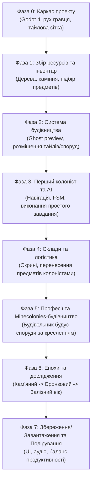

# Концепція та Архітектура гри: Saecula (Top-Down Sandbox Colony Sim)

---

## 1. Загальне бачення гри (Vision & Pitch)

**Saecula** — це ізометрична/2D top-down пісочниця з акцентом на виживання, ручну розбудову та автономний симулятор поселення з переходом між історичними епохами.

### Ключові референси:
* **Minecolonies (Minecraft mod)** — колоністи мають власну волю, ходять ніжками, потребують ресурси, будують будівлі блок за блоком/елемент за елементом на основі креслень (blueprints).
* **RimWorld / Necesse** — управління пріоритетами, виробничими ланцюгами, складами та професіями жителів з видом зверху.
* **The Survivalists / Forager** — гравець сам є активним учасником світу: бігає, рубає дерева, будує перші споруди власними руками, а згодом делегує рутину колоністам.
* **Dawn of Man / Age of Empires** — глибока технологічна еволюція від примітивного Кам'яного віку до високого Середньовіччя/Ренесансу.


!IMPORTANT! керування жителями відбувається як в (going medieval/Craft The World)
---

## 2. Ключові стовпи геймплею (Core Pillars)

1. **Гібридний ігровий процес (Direct Action + Macro Management):**
   * Гравець безпосередньо керує своїм персонажем (WASD + миша), має власний інвентар, може самостійно крафтити, захищатися і будувати.
   * Водночас гравець ставить "замовлення" (Work Orders / Blueprints) для поселення: жителі беруть інструменти зі складів, приносять ресурси і виконують роботу.
2. **Органічний інтелект колоністів (Agent-Based Simulation):**
   * Жителі — це повноцінні агенти у світі. Вони фізично йдуть до складу, беруть колоду, йдуть до будівельного майданчика, ставлять її.
   * Якщо колоністу не вистачає ресурсу, він генерує запит (Request), який може виконати кур'єр або сам гравець.
3. **Епохальна еволюція (Era Progression):**
   * **Кам'яний вік (Stone Age):** примітивні знаряддя праці (кремінь, дерево), багаття, курінь, збиральництво та просте полювання.
   * **Мідний/Бронзовий вік (Bronze Age):** перші печі випалу, кераміка, прості поля, дерев'яні хатини, спеціалізовані ями для зберігання.
   * **Залізний вік (Iron Age):** домниці, ковальство, кам'яні мури, мощені дороги (прискорюють рух робітників), водяні млини, варта.
   * **Середньовіччя (Medieval Age):** гільдії, мануфактури, вітряки, розвинене землеробство, освіта/бібліотека, захист від набігів.

---

## 3. Рекомендований технологічний стек

З огляду на вимогу `stack godot` у проекті та потребу в стабільній роботі без зайвого оверхеду:

### **Godot Engine 4.x (GDScript + Typed)**
* **Чому Godot 4 ідеальний для цієї гри:**
  1. **Легковажність та стабільність:** Запускається за секунду, не вимагає гігабайтних лаунчерів чи компіляцій, гра компілюється в один швидкий бінарник.
  2. **TileMapLayer та 2D Grid:** У Godot 4 оновлена тайлова система чудово підтримує шари (земля, об'єкти, стіни, навігація).
  3. **NavigationServer2D та AStar2D:** Вбудовані швидкі алгоритми пошуку шляхів для сотень агентів у реальному часі.
  4. **Система ресурсів (Custom Resources / `.tres`):** Дає змогу реалізувати data-driven дизайн (рецепти, предмети, технології зберігаються окремо від коду).
  5. **Ідеальна сумісність з LLM (Gemini 3.8 Flash):** GDScript зі статичною типізацією (`var speed: float = 100.0`) є надзвичайно читабельним, передбачуваним і мінімізує синтаксичні галюцинації ШІ.
  6. **Підтримка роздільної здатності (1920x1080 та 2560x1440):** Гра обов'язково та стабільно підтримує стандартний Full HD (1920x1080) та 2K QHD (2560x1440) у форматі 16:9. Режим розтягування `canvas_items` (`window/stretch/mode = "canvas_items"`, `aspect = "keep"`) забезпечує чітке масштабування 2D-тайлів без розмиття текстур та адаптивне розміщення інтерфейсу й шрифтів на обох роздільних здатностях.

---

## 4. Архітектура гри (Game Architecture & Systems)

Для збереження стабільності під час кодогенерації ШІ проект має бути розбитий на ізольовані модулі за принципом **Single Responsibility** (один файл — одна відповідальність):

```
saecula_2/
├── assets/                  # Спрайти, тайлсети, звуки, шрифти
├── data/                    # Data-driven ресурси (Items, Recipes, Eras, Buildings)
│   ├── items/               # .tres файли предметів
│   ├── recipes/             # .tres файли рецептів крафту
│   ├── buildings/           # .tres параметри споруд та їхні схеми
│   └── eras/                # Технологічні дерева епох
├── src/
│   ├── core/                # Глобальні менеджери (Autoloads)
│   │   ├── GameManager.gd   # Стан гри, пауза, день/ніч
│   │   ├── EventBus.gd      # Глобальні сигнали (Event-driven decoupled communication)
│   │   ├── EraManager.gd    # Поточна епоха, відкриті дослідження
│   │   └── SaveManager.gd   # Збереження та завантаження світу (JSON/ConfigFile)
│   ├── world/               # Світ, сітка, процедурна/тайлова генерація
│   │   ├── GridManager.gd   # Координати тайлів, зайнятість клітинок
│   │   └── WorldGen.gd      # Спавн ресурсів (дерева, каміння, руди)
│   ├── entities/            # Живі сутності
│   │   ├── player/          # Персонаж гравця, керування, інвентар
│   │   └── colonist/        # Колоністи, AI, машина станів (FSM)
│   ├── systems/             # Підсистеми колонії
│   │   ├── inventory/       # Базовий компонент інвентаря
│   │   ├── jobs/            # JobManager, TaskQueue, типи завдань
│   │   ├── building/        # Будівельні майданчики, розміщення креслень
│   │   └── logistics/       # Склади, логіка перенесення вантажів
│   └── ui/                  # Інтерфейс користувача (Control вузли)
│       ├── hud/             # Гаряча панель, здоров'я, час
│       ├── colony_ui/       # Меню професій, список замовлень, статистика
│       └── tech_tree_ui/    # Вікно епох і досліджень
```

### 4.1. EventBus (Шина подій)
Замість перехресного виклику методів між колоністами, будинками та гравцем, використовується реактивна шина подій:
* `EventBus.job_created(job)`
* `EventBus.resource_harvested(item_id, amount, position)`
* `EventBus.building_placed(blueprint_id, grid_pos)`
* `EventBus.era_advanced(new_era_id)`

### 4.2. Система завдань (Job & Task System a-la Minecolonies)
Це серце гри. Гравець не керує жителями як юнітами в RTS. Гравець генерує **Job Request**:
1. **Черга завдань (`JobManager`):** зберігає пріоритетний список завдань (будівництво, вирубка, доставка, фермерство).
2. **Призначення (`Dispatch`):** Вільний колоніст відповідної професії запитує у `JobManager` найближче валідне завдання.
3. **Виконання кроків (`Task Steps`):**
   * *Крок 1:* Перевірити наявність ресурсів на найближчому складі (`Stockpile`).
   * *Крок 2:* Прокласти шлях (AStar2D) до складу, взяти ресурси.
   * *Крок 3:* Прийти на будівельний майданчик.
   * *Крок 4:* Витрачати час на будівництво (`work_time`), створюючи візуальний прогрес.
   * *Крок 5:* Повідомити `JobManager` про завершення.

---

## 5. Механіка Епох (Era Progression)

| Епоха | Будівництво | Матеріали та інструменти | Ролі колоністів | Джерела їжі |
| :--- | :--- | :--- | :--- | :--- |
| **1. Кам'яний вік** | Землянки, курені з гілок, багаття | Дерево, кремінь, палиці, волокно | Збирач, Мисливець, Примітивний будівельник | Ягоди, сире/смажене м'ясо |
| **2. Бронзовий вік** | Дерев'яні зруби, огорожі, ями-сховища | Обтесане дерево, мідь, олово, бронза | Дроворуб, Землекоп, Гончар, Фермер | Зерно, коржі, овочі |
| **3. Залізний вік** | Кам'яні фундаменти, частоколи, склади | Залізо, камінь, цегла, шкіра | Шахтар, Коваль, Каменяр, Охоронець/Вартовий | Печений хліб, тушковане м'ясо |
| **4. Середньовіччя** | Фортечні стіни, млини, ратуша, цехи | Сталь, черепиця, розчин, скло | Мельник, Пекар, Вчений, Торговець | Складна кулінарія, пивоваріння |

**Умова переходу в наступну епоху:**
* Виконання ключових умов (наприклад: побудувати Ратушу відповідного рівня, накопичити певну кількість сплавів, провести дослідження на Спеціальному столі досліджень).
* При переході змінюються: доступні рецепти, зовнішній вигляд нових будівель, швидкість роботи та вимоги колоністів (їм потрібні кращі ліжка, якісніша їжа).

---

## 6. Покрокова дорожня карта (Roadmap) розробки



### Деталі фаз:
1. **Фаза 0 (База):** Налаштування вікна гри, Top-Down рух персонажа (CharacterBody2D), камера з масштабуванням (zoom/pan), TileMapLayer з навігаційною сіткою.
2. **Фаза 1 (Взаємодія зі світом):** Спавн дерев та каменів як окремих об'єктів або шару тайлів. Ручне добування інструментом. Дроп предметів, інвентар гравця.
3. **Фаза 2 (Будівництво гравцем):** Система розміщення будівель по сітці (Grid snapping). Перевірка колізій (чи не зайнята клітинка). Списування ресурсів.
4. **Фаза 3 (Агент-колоніст):** Спавн NPC з NavigationAgent2D. Машина станів: `IDLE` -> `MOVE_TO` -> `HARVEST/WORK`. Тест: житель самостійно йде зрубати дерево, позначене гравцем.
5. **Фаза 4 (Логістика складів):** Об'єкт `Stockpile` / `Chest`. Житель після вирубки несе дерево на склад. Замовлення на ресурси зі складу.
6. **Фаза 5 (Будівельник Minecolonies-типу):**
   * Гравець ставить напівпрозорий "привид" (Blueprint) хатини.
   * Будинок потребує: 10 дерева, 5 каменю.
   * Колоніст-будівельник бачить цей Blueprint -> приносить дерево зі складу -> забиває кілочки -> будинок стає готовим фізичним об'єктом.
7. **Фаза 6 (Дерево епох):** Стіл досліджень. Прогрес технологій. Блокування рецептів та будівель, доки епоха не розблокована.
8. **Фаза 7 (Збереження та оптимізація):** Серіалізація стану світу, будівель та інвентарів у JSON/ConfigFile. Налагодження стабільності.

---

## 7. Як розробляти цей проект разом з Gemini 3.8 Flash в Antigravity

Gemini 3.8 Flash — швидка модель з великим контекстним вікном. Щоб розробка йшла без багів та плутанини, дотримуйся таких правил взаємодії:

### Правило 1: "Одна фіча за один промпт" (Micro-iterations)
Ніколи не проси ШІ написати "всю систему колонії відразу".
* *Поганий запит:* "Зроби мені повністю колоністів, склади і систему будівель".
* *Правильний запит:* "Давай створимо `InventoryComponent.gd`, який матиме масив слотів, методи `add_item()`, `remove_item()` та сигнал `inventory_changed`".

### Правило 2: Строга типізація GDScript 2.0
Завжди вимагай статичну типізацію. Це виключає 90% помилок рандому типів:
```gdscript
# Правильний стиль для промптів:
class_name Colonist
extends CharacterBody2D

@export var move_speed: float = 80.0
var current_job: Job = null
var inventory: InventoryComponent
```

### Правило 3: Data-Driven підхід (Відокремлення даних від логіки)
Всі предмети та рецепти створюються як Godot `Resource`.
* Коли треба додати "Залізну сокиру" або "Кам'яну кирку", ШІ не редагує код гравця чи колоніста, а просто створює новий файл `ItemData.tres`.

### Правило 4: Чіткий контракт інтерфейсів (Contract-First)
Перед реалізацією системи узгоджуй структуру методів. Наприклад, для `JobManager`:
* `register_job(job: Job) -> void`
* `request_job(colonist: Colonist) -> Job`
* `cancel_job(job_id: String) -> void`

---

## 8. Перший практичний крок (Quick Start)
Починай розробку строго за чеклістом у [WORKLIST.md](file:///C:/Users/Sasha/OneDrive%20-%20UCU/Робочий%20стіл/work_dir/personal/saecula_2/WORKLIST.md), починаючи з Етапу 1 (Ітерація 1.1).
