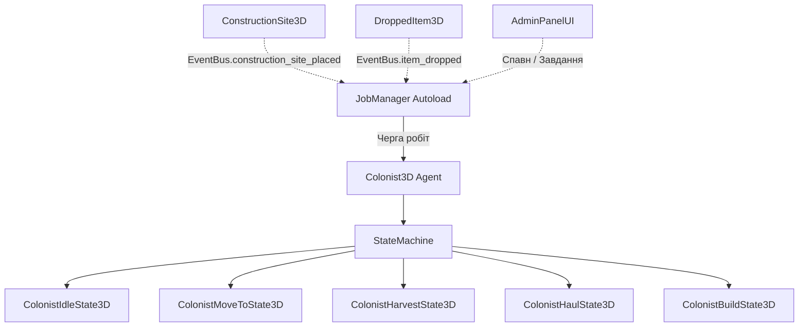

# Документація проекту Saecula

## 1. Загальна конфігурація рушія (Godot 4.x)
- **Версія конфігурації:** `config_version=5` (Godot 4.x).
- **Рендерер:** `gl_compatibility` (OpenGL 3 / WebGL 2 сумісний рендерер) для найвищої сумісності та плавної продуктивності без оверхеду важких шейдерів.
- **Піксельна точність (Pixel Snap):**
  - `snap_2d_transforms_to_pixel = false` (вимкнено для безвібраційної субпіксельної інтерполяції камери).
  - `snap_2d_vertices_to_pixel = false`
  - `default_texture_filter = 0` (Nearest) для чіткого відмалювання піксель-арту та тайлів.

## 2. Підтримка роздільної здатності (Resolution & Stretch Mode)
- **Базовий Viewport:** 1920x1080 (Full HD, 16:9).
- **Підтримка 2K QHD:** 2560x1440 (16:9).
- **Режим розтягування (Stretch Mode):**
  - `mode = "canvas_items"` — 2D вузли та канвас масштабуються відповідно до співвідношення сторін без спотворення пікселів.
  - `aspect = "keep"` — запобігає розтягуванню пропорцій.
  - Усі елементи інтерфейсу (HUD, інвентар, меню) використовують адаптивні якорі (`Anchors & Containers`) замість абсолютних координат, що забезпечує однаково ідеальний вигляд як на 1080p, так і на 1440p моніторах.

## 3. Модульна структура директорій (Directory Layout)
```
saecula_2/
├── assets/                  # Ресурси гри
│   ├── audio/               # Звукові ефекти та музика
│   ├── fonts/               # Шрифти
│   ├── sprites/             # Спрайти та тайлсети
│   └── ui/                  # Текстури інтерфейсу
├── data/                    # Data-Driven ресурси (.tres)
│   ├── buildings/           # Схеми та параметри будівель (campfire 4x4, stockpile 6x6, wooden_hut 10x10)
│   ├── eras/                # Дерева епох та умови переходу
│   ├── items/               # Визначення предметів (wood, stone, flint, berries, stone_axe, stone_pickaxe, campfire)
│   ├── recipes/             # Рецепти крафту (craft_stone_axe.tres, craft_stone_pickaxe.tres, craft_campfire.tres)
│   └── schemas/             # GDScript схеми даних (ItemData.gd, ItemCost.gd, RecipeData.gd, BuildingData.gd)
├── src/                     # Вихідний код логіки гри
│   ├── core/                # Глобальні Autoloads (EventBus, GameManager, ItemDatabase)
│   ├── core3d/              # 3D камери та контролери огляду (RTSCamera3D.gd, RTSCamera3D.tscn)
│   ├── entities/            # 2D Ігрові сутності
│   ├── entities3d/          # 3D Ігрові сутності
│   │   ├── items/           # 3D Дроп предметів (DroppedItem3D.gd, DroppedItem3D.tscn)
│   │   └── player/          # 3D Гравець від 1-ї особи (Player3D.gd, Player3D.tscn)
│   ├── systems/             # Підсистеми колонії
│   │   ├── building/        # Будівельні майданчики та креслення (BuildingPlacementController.gd)
│   │   ├── crafting/        # Менеджер крафту (CraftingManager.gd)
│   │   ├── inventory/       # Компонент інвентаря (InventoryComponent.gd, InventorySlot.gd)
│   │   ├── jobs/            # JobManager та черга замовлень
│   │   └── logistics/       # Склади та доставка
│   ├── ui/                  # Інтерфейс користувача (Control вузли)
│   │   └── hud/             # HotbarUI, InventoryUI, CraftingUI, ItemSlotUI, CrosshairUI, ModeIndicatorUI, BuildMenuUI
│   ├── world/               # 2D сітка та системи (GridManager.gd, ConstructionSite.gd)
│   └── world3d/             # 3D Світ (World3D.gd, WorldResourceNode3D.gd, BuildingGhost3D.gd, ConstructionSite3D.gd, BuildingEntity3D.gd)
```

## 4. Мапа клавіш введення (Input Map)
| Дія (Action) | Призначення | Клавіші за замовчуванням |
| :--- | :--- | :--- |
| `move_up` | Рух вгору / вперед | `W`, `Up Arrow` |
| `move_down` | Рух вниз / назад | `S`, `Down Arrow` |
| `move_left` | Рух ліворуч | `A`, `Left Arrow` |
| `move_right` | Рух праворуч | `D`, `Right Arrow` |
| `jump` | Стрибок у режимі 1-ї особи | `Space` |
| `interact` | Взаємодія / Збір перед собою / Доставка матеріалів / Будівництво | `E` |
| `primary_action` | Основна дія / Видобуток кліком / Підтвердження будівництва | `Left Mouse Button` |
| `cancel` | Скасування / Меню / Пауза | `Escape` |
| `colony_mode_toggle` | Перемикання: Гравець (1st-Person) <-> Колонія (Top-Down RTS) | `Tab` |
| `inventory_toggle` | Відкрити/закрити інвентар | `I` |
| `crafting_toggle` | Відкрити/закрити меню крафту | `C` |
| `build_mode_toggle` | Відкрити/закрити меню будівництва | `B` |
| `toggle_fullscreen` | Повноекранний режим | `F11` |
| `quit_game` | Вийти з гри | `F12` |
| `toggle_debug_grid` | Увімкнути/вимкнути відладочну сітку | `F3` |
| `zoom_in` | Наближення камери | `Mouse Wheel Up` |
| `zoom_out` | Віддалення камери | `Mouse Wheel Down` |
| `secondary_action`| Додаткова дія (скасування розміщення/меню)| `Right Mouse Button` |
| `hotbar_1`..`hotbar_8` | Швидкий вибір предметів | Цифри `1`–`8` |
| `demolish_building` | Демонтаж споруд та будівельних майданчиків | `X` |
| `order_harvest` | Швидкий наказ робітникам на збір ресурсу | `H` |
| `toggle_colonist_roster` | Список робітників поселення | `K` |
| `admin_panel_toggle` | Відкрити/закрити Адмін-панель налагодження | `F1` або `~` |

## 5. Глобальні сінглтони (Autoloads)

### 5.1. `EventBus` (`res://src/core/EventBus.gd`)
Слугує центральною шиною сигналів. Підсистеми не викликають методи один одного напряму, а підписуються на події.

### 5.2. `GameManager` (`res://src/core/GameManager.gd`)
Керує загальним станом гри (`GameState`), вікном програми (`toggle_fullscreen`, `quit_game`) та симуляцією часу доби.
Перемикає режими за клавішею `Tab` (`PLAYING` <-> `COLONY_MODE`), або переходить у `BUILDING_MODE` при виборі креслення.

### 5.3. `GridManager` (`res://src/world/GridManager.gd`)
Центральний менеджер тайлової сітки (32x32 у 2D, 2.0м у 3D) та навігації юнітів на базі `AStarGrid2D`.
Надає методи просторової трансформації:
- `world_to_map_3d(world_pos: Vector3) -> Vector2i`
- `map_to_world_3d(map_pos: Vector2i, y: float = 0.0) -> Vector3`
- `get_world_path_3d(from_world: Vector3, to_world: Vector3, y: float = 0.0) -> PackedVector3Array`
- `register_occupant(cell, occupant, is_solid)` / `unregister_occupant(cell, set_walkable)` / `get_occupant(cell)`

### 5.4. `ItemDatabase` (`res://src/core/ItemDatabase.gd`)
Глобальний реєстр даних предметів гри. Сканує директорію `res://data/items/`, кешує знайдені `.tres` ресурси та надає миттєвий доступ через `ItemDatabase.get_item(&"id")`.

### 5.5. `CraftingManager` (`res://src/systems/crafting/CraftingManager.gd`)
Центральний менеджер крафту. Сканує `res://data/recipes/`, кешує рецепти, перевіряє доступність за епохою та наявністю матеріалів в інвентарі, списує ресурси та створює новий предмет.

### 5.6. `BuildingPlacementController` (`res://src/systems/building/BuildingPlacementController.gd`)
Центральний контролер розміщення будівель. Сканує `res://data/buildings/`, кешує дані споруд, розраховує мультитайловий футпринт та валідує координати сітки на відсутність перешкод.

## 6. Компонент інвентаря (`InventoryComponent.gd`)
- **Призначення:** Модульний контейнер зберігання предметів для гравця, жителів, скринь, будівельних складів.
- **Слоти (`InventorySlot.gd`):** Зберігають `item: Resource` та `count: int`.
- **Сигнали:** `inventory_updated`, `slot_changed(slot_index)`, `item_added(item, amount)`, `item_removed(item_id, amount)`.
- **API:**
  - `add_item(item: Resource, amount: int) -> int` — додає предмети зі стакуванням до `max_stack`, повертає залишок.
  - `add_item_by_id(item_id: StringName, amount: int) -> int` — додає предмет напряму через `ItemDatabase`.
  - `remove_item(item_id: StringName, amount: int, allow_partial: bool = false) -> bool` — видаляє вказану кількість.
  - `has_item(item_id: StringName, amount: int = 1) -> bool` — перевіряє наявність предметів.
  - `get_item_count(item_id: StringName) -> int` — повертає загальну кількість предметів у всіх слотах.
  - `get_all_items() -> Array[Dictionary]` — повертає всі непорожні слоти для UI та збереження.

## 7. Користувацький інтерфейс: Hotbar, Інвентар, Крафт, Меню будівництва (`HUD.tscn`)
- **Шар інтерфейсу (`CanvasLayer`, layer = 10):** Завжди відмальовується поверх 3D світу без спотворень.
- **`CrosshairUI` (`Control`):** Акуратний приціл по центру екрана, активний лише в режимі First-Person при захопленій мишці.
- **`ModeIndicatorUI` (`PanelContainer`):** Стильна плашка у верхній частині екрана, що повідомляє поточний режим ("РЕЖИМ ГРАВЦЯ (1st Person)", "РЕЖИМ ПОСЕЛЕННЯ (Top-Down RTS)" або "РЕЖИМ БУДІВНИЦТВА (Top-Down RTS)") та підказку `[Tab]`.
- **`ItemSlotUI` (`Control`):** Універсальний слот 52x52 px. Відображає рамку, іконку ресурсу, лічильник стаку та гарячу клавішу.
- **`HotbarUI` (`Control`):** Розташований по центру внизу екрана (Anchor Preset `Center Bottom`). Відображає перші 8 слотів.
- **`InventoryUI` (`Control`):** Повне вікно інвентаря на 24 слоти (6x4). Відкривається/закривається на `I` або `Escape`. При відкритті звільняє курсор миші.
- **`CraftingUI` (`Control`):** Меню крафту знарядь та предметів. Відкривається/закривається на `C` або `Escape`.
- **`BuildMenuUI` (`Control`):** Меню каталогу будівель та креслень. Відкривається/закривається на `B` або `Escape`. Надає вибір доступних споруд та активує режим розміщення.

## 8. 3D Архітектура та гібридний режим камер (First-Person Player + Top-Down RTS Colony Mode)

### 8.1. Контролер гравця від першої особи (`Player3D.gd`, `Player3D.tscn`)
- **Тип вузла:** `CharacterBody3D`, група `"player"`.
- **Огляд мишею:** При активному режимі курсор захоплюється (`MOUSE_MODE_CAPTURED`). Рух миші обертає персонажа по осі Y та голову (`Head`) по осі X з обмеженням [-85°, +85°].
- **Рух:** WASD переміщення з урахуванням напрямку погляду, гравітація та стрибки на клавішу `Space` (`jump`).
- **Взаємодія/Видобуток:** `RayCast3D` довжиною 3.2м спрямований вперед від камери. При натисканні `ЛКМ` або `E` перевіряє колізію з `WorldResourceNode3D` або `ConstructionSite3D`, визначає екіпірований у хотбарі інструмент та викликає відповідну дію.
- **Інвентар:** Містить вбудований компонент `InventoryComponent` (24 слоти). При старті отримує початковий набір (сокира, кайло, дерево, камінь).

### 8.2. RTS Камера менеджменту зверху (`RTSCamera3D.gd`, `RTSCamera3D.tscn`)
- **Тип вузла:** `Node3D` (базовий якір на площині землі) + дочірня `Camera3D`, нахилена під кутом ~55° (Dota 2 / Factorio стиль).
- **Керування:**
  - `WASD`: переміщення якірної точки над картою поселення зі швидкістю 28.0.
  - `Коліщатко миші` (`zoom_in` / `zoom_out`): плавний зум висоти від 10м до 65м для комфортного огляду великих споруд.
  - `ЛКМ`: 3D Raycast проекція променя курсора у світ (`project_ray_origin` / `project_ray_normal`). Клік по ресурсу видобуває його; клік по будмайданчику доставляє матеріали/будує; клік у режимі розміщення креслення фіксує його на землі.
  - `ПКМ` / `Escape`: скасування активного розміщення креслення та вихід у звичайний RTS режим.

### 8.3. 3D Світ та процедурні ресурси (`World3D.gd`, `World3D.tscn`)
- **Вузол `World3D`:**
  - Масштаб карти: 80x80 тайлів (160м x 160м), що створює достатньо простору для розбудови поселення.
  - `WorldEnvironment`: процедурний скайбокс (`ProceduralSkyMaterial`), тональна компресія та м'яке фонове освітлення.
  - `DirectionalLight3D`: сонячне світло з підтримкою динамічних тіней (`shadow_enabled = true`).
  - `Ground`: земля з колізією (`StaticBody3D`) та зеленим матеріалом поверхні.
  - Спавнить гравця `Player3D`, камеру `RTSCamera3D`, креслення-привид `BuildingGhost3D` та контейнер споруд `$Buildings`.
  - Стартовий будівельний майданчик: при появі гри автоматично спавнить майданчик вогнища (2x2) безпосередньо перед гравцем.
  - Процедурно генерує 3D ресурси (дерева, каміння, кущі) за межами радіуса 16 тайлів від центру появи, гарантуючи вільну галявину діаметром 32 тайли для розбудови колонії.

### 8.4. 3D Природні ресурси (`WorldResourceNode3D.gd`, `WorldResourceNode3D.tscn`)
- **Тип вузла:** `StaticBody3D`, група `"resource_nodes"`.
- **Процедурні моделі:**
  - `TREE`: стовбур із циліндричної геометрії та багатошарова крона з 3 конусів різних відтінків зеленого кольору.
  - `ROCK`: багатогранна основна скеля та бічний камінь з акцентним кутом.
  - `BUSH`: листяний кущ зі сферичної форми та грона яскраво-червоних ягід.
- **Фізика та механіка:**
  - Блокує клітинку у `GridManager` на площині X-Z.
  - Реагує на видобуток `harvest(damage, tool_type)` з подвійним бонусом для профільних інструментів.
  - Анімація удару через 3D scale/wobble `Tween`.
  - При вичерпанні міцності очищає клітинку в `GridManager` та спавнить `DroppedItem3D`.

### 8.5. 3D Дроп предметів (`DroppedItem3D.gd`, `DroppedItem3D.tscn`)
- **Тип вузла:** `Area3D`.
- **Візуалізація:** Процедурна 3D модель відповідного предмета (дерев'яний брус, камінь, кремінь, ягоди, сокира, багаття тощо).
- **Поведінка:** Повільно обертається та погойдується над землею. При наближенні гравця у радіусі 3.5м плавно притягується магнітом та зараховується в інвентар через `InventoryComponent.add_item_by_id`.

## 9. Система розміщення споруд та креслень (Building Placement System)

### 9.1. Габарити будівель
Специфікація розмірів споруд гри:
1. **Табірне вогнище (`campfire.tres`):**
   - Розмір: **2x2 тайли** (4x4м, 4 клітинки).
   - Призначення: центральне вогнище поселення, зона обігріву, світла та первинного виживання.
   - Вартість: 4 дерева + 4 каменю.
   - Час спорудження: 4.0 сек.
2. **Головний склад ресурсів (`stockpile.tres`):**
   - Розмір: **6x6 тайлів** (12x12м, 36 клітинок).
   - Призначення: велика відкрита зона зберігання ресурсів, матеріалів та знарядь праці (32 слоти сховища).
   - Прохідність: `is_solid = false` (колоністи та гравець вільно ходять майданчиком складу).
   - Вартість: 6 дерева.
   - Час спорудження: 6.0 сек.
3. **Дерев'яна хатина колоністів (`wooden_hut.tres`):**
   - Розмір: **8x8 тайлів** (16x16м, 64 клітинки).
   - Призначення: просторий житловий комплекс та майстерня будівельних робіт (`builder`).
   - Прохідність: `is_solid = true`.
   - Вартість: 8 дерева + 4 каменю.
   - Час спорудження: 10.0 сек.

### 9.2. Креслення-привид (Blueprint Ghost 3D, `BuildingGhost3D.gd`)
- Динамічно підлаштовує розмір геометричного боксу під розмір поточної споруди: `Vector3(size.x * 2.0 - 0.1, 1.2, size.y * 2.0 - 0.1)`.
- Позиціонується точно за центром прямокутника споруди: `center = (origin + size * 0.5) * TILE_SIZE_3D`.
- Візуальний статус:
  - **Смарагдово-зелений** напівпрозорий матеріал із світінням: ділянка повністю вільна та готова до будівництва.
  - **Яскраво-червоний** матеріал: хоча б одна клітинка зайнята природним ресурсом або виходить за межі карти.
- Плаваючий 3D Billboard текст із назвою будівлі, розмірами в тайлах та інструкцією гарячих клавіш (`ЛКМ` / `ПКМ` / `Esc`).

### 9.3. Будівельний майданчик (`ConstructionSite3D.gd`, `ConstructionSite3D.tscn`)
- **Тип вузла:** `StaticBody3D`, групи `"construction_sites"`, `"interactable"`.
- **Блокування сітки:** Реєструється у `GridManager.register_occupant(c, self, true)` для всіх займаних клітинок (16 клітинок для 4x4 вогнища (4x4м), 36 для складу (6x6м), 100 для хатини (10x10м)).
- **Матеріали:**
  - Зберігає словник потрібних ресурсів (`required_materials: Dictionary`) та фактично доставлених (`delivered_materials: Dictionary`).
  - Методи: `can_accept_material(id)`, `get_remaining_needed(id)`, `deliver_material(id, amount)`, `is_materials_ready()`.
- **Будівельні роботи:**
  - `build_work(amount)` — можливий тільки після 100% заповнення буфера матеріалів.
  - Прогрес вимірюється в секундах від 0.0 до `build_time`.
- **Візуалізація:**
  - Процедурна земляна розмітка-настил, 4 кутові кілки, огорожа з канату.
  - 3D Billboard `Label3D` з ASCII індикатором (`[■■■■□□□□□□] 40%`) та переліком доставлених ресурсів.
  - Анімація фізичного похитування (`wobble tween`) при роботі молотком.
- **Конвертація:**
  - Після закінчення робіт автоматично створює завершену споруду `BuildingEntity3D`, передає володіння клітинками, сповіщає `EventBus.building_completed` та звільняє майданчик.

### 9.4. Завершена фізична будівля (`BuildingEntity3D.gd`, `BuildingEntity3D.tscn`)
- **Тип вузла:** `StaticBody3D`, групи `"buildings"`, `"interactable"`.
- **Реєстрація у сітці:** Займає тайли через `GridManager.register_occupant(c, self, building_data.is_solid)`. Склад залишається прохідним (`is_solid = false`), вогнище та хатина — непрохідними (`is_solid = true`).
- **Сховище:** При `storage_slots > 0` створює `InventoryComponent` (склад на 32 слоти).
- **Процедурні 3D моделі:**
  - **Вогнище (`campfire`):** масштабоване під 2x2 кам'яне кільце валунів по колу, 4 схрещені колоди, палаюче вугілля та конус полум'я, мерехтливе джерело світла `OmniLight3D`.
  - **Склад (`stockpile`):** дощатий настил платформи 8x8м, 4 кутові стовпи, 6 декоративних ящиків із товарами.
  - **Хатина (`wooden_hut`):** просторі стіни зрубу 10x10м, двосхилий дах-призма, дубові двері, настінний ліхтар біля входу.
- **Демонтаж:** Метод `demolish()` повністю очищає клітинки сітки та надсилає сигнал `EventBus.building_demolished`.

## 10. Система логістики та сховищ поселення (Logistics & Stockpiles, Ітерація 7.1)

### 10.1. Глобальний менеджер логістики (`LogisticsManager.gd`)
- **Тип вузла:** `Node` (Autoload синглтон `LogisticsManager`).
- **Функціонал:**
  - Централізований облік усіх активних складів та сховищ колонії (`stockpiles: Array[Node]`).
  - Відстеження загальної кількості будь-якого ресурсу в мережі колонії через `get_available_item_count(item_id: StringName) -> int` та `get_total_stored_items() -> Dictionary`.
  - Пошук складів для автоматизації (робітників-носіїв або будівельників): `find_stockpile_with_item(item_id, min_amount)` та `find_stockpile_with_space(item_id, amount)`.
  - Автоматичне оновлення подій `EventBus.colony_storage_updated` при зміні вмісту будь-якого складу.

### 10.2. Склад ресурсів у 2D та 3D (`StockpileBuilding.gd` та `BuildingEntity3D.gd`)
- **Параметри:** розмір 6x6 клітинок (6x6м у 3D), місткість 32 слоти.
- **Прохідність:** `is_solid = false` (колоністи та гравець можуть вільно проходити через настил складу).
- **Реєстрація:** при переході в дерево сцени автоматично реєструється в `LogisticsManager`, при демонтажі або видаленні — знімається з обліку.
- **Індикація в 3D:** динамічний Billboard `Label3D` відображає кількість зайнятих слотів та сумарну кількість предметів.

### 10.3. Інтерфейс передачі предметів (`StorageUI.gd`, `StorageUI.tscn`)
- **Розташування:** шар `CanvasLayer` у сцені `HUD.tscn`.
- **Структура вікна:**
  - Ліва колонка: Інвентар гравця (24 слоти, 6x4) + кнопка швидкого вивантаження «⬇ Покласти все на склад».
  - Права колонка: Сховище складу (32 слоти, 8x4) + кнопка швидкого завантаження «⬆ Забрати все в інвентар».
- **Керування курсором та введенням:** при відкритті сховища миша звільняється (`MOUSE_MODE_VISIBLE`), при закритті у режимі 1-ї особи — знову захоплюється (`MOUSE_MODE_CAPTURED`). Вікно закривається клавішами `Escape`, `E`, `I` або кліком по темному тлу.

### 10.4. Розумний розподіл точок навколо складу (Anti-crowding Perimeter Distribution, Ітерація 7.41)
- **Проблема скупчення в центрі:** Раніше колоністи при розвантаженні чи заборі ресурсів прямували безпосередньо до центру складу (global_position), що викликало штовханину фізичних тіл колоністів, застрягання та блокування руху інших робітників.
- **Динамічний розрахунок периметральних клітинок (get_stockpile_perimeter_cells):**
  - Обчислює кільце клітинок навколо фактично зайнятої складом площі (occupied_cells або габарити size з урахуванням повороту 
otation_degrees.y).
  - Фільтрує лише прохідні клітинки сітки (GridManager.is_cell_walkable), відсікаючи природні перешкоди (скелі, дерева) та збудовані конструкції.
- **Система бронювання слотів підходу (_claimed_arrival_slots):**
  - get_stockpile_arrival_position(stockpile, actor) підбирає найкращу вільну точку на периметрі з урахуванням евристичного скорингу:
    - базовий штраф = відстань від колоніста до клітинки.
    - штраф за заброньований слот іншим робітником = +50.0.
    - штраф за скупчення колоністів поблизу точки = +30.0 (<0.9м) / +10.0 (<1.6м).
  - Забезпечено безпечний 8-точковий радіальний фолбек для об'єктів нестандартної геометричної конфігурації або відсутності вільних клітинок сітки навколо.
  - Автоматичне очищення недійсних записів _clean_stale_reservations().
  - Метод 
elease_arrival_position(actor) гарантує звільнення слота після завершення розвантаження, при виході зі стану FSM haul, або при скасуванні завдання робітника.

## 11. Меню будівництва та система креслень (Factorio Blueprints, Ітерація 7.2)

### 11.1. Інтерфейс вибору споруд (`BuildMenuUI.gd`, `BuildMenuUI.tscn`)
- **Спосіб відкриття:**
  - Гаряча клавіша `B` (режим 1-ї особи або RTS).
  - Кнопка швидких дій на екрані `[🔨 Будівництво (B)]` у `HUDActionBar` (`HUD.tscn`).
  - Автоматичне звільнення курсору миші (`Input.MOUSE_MODE_VISIBLE`).
- **Фільтрація та Категорії:**
  - Вкладки: «Усі споруди», «🔥 Базові» (Campfire), «📦 Сховища» (Stockpile 4x4), «🏠 Житло & Праця» (Wooden Hut 6x6).
  - Підсвічування активної категорії кольоровим індикатором.
- **Інформація у картках споруд:**
  - Іконка/текстура попереднього перегляду споруди.
  - Назва та розмір у тайлах і метрах (наприклад, `[2x2 тайли / 4x4м]`, `[4x4 тайли / 8x8м]`, `[6x6 тайлів / 12x12м]`).
  - Спеціалізація (обігрів, місткість складу, житло, професія колоніста).
  - Стан ресурсів: перевіряє суму матеріалів в інвентарі гравця та на складах колонії через `LogisticsManager`, підсвічуючи зеленим або жовтим кольором.
  - Кнопка «📐 Встановити креслення»: закриває меню та переводить камеру у режим розміщення.

### 11.2. Голографічна система блупрінтів (`BlueprintVisualHelper.gd`)
- **Візуальний стиль Factorio:**
  - Спеціальний матеріал `create_hologram_material()` з прозорістю `TRANSPARENCY_ALPHA`, неоново-ціановим забарвленням `Color(0.18, 0.68, 1.0, 0.42)`, свіченням та відсутністю Backface Culling (`cull_mode = CULL_DISABLED`).
  - Пульсація емісії у реальному часі через `_process(delta)` на будівельному майданчику.
- **Генерація силуетів будівель:**
  - `campfire`: кільце з каміння, перехрещені колоди та світиться блакитне серце полум'я.
  - `stockpile`: поперечні дощаті лаги платформи, 4 кутові стовпи та голографічні контури ящиків.
  - `wooden_hut`: 4 колодяні стіни з вирізом дверей та двосхилі плити даху.
  - `generic`: контурна рама з кутовими стійками.

### 11.3. Встановлення та зведення споруд
- **Обертання креслень та споруд (Blueprint Rotation на [R] / [Shift+R]):**
  - Під час проектування (`BUILDING_MODE`) гравець може натискати клавішу `R` (дія `rotate_building`, прив'язана до фізичного скан-коду 82) для циклічного повороту споруди за годинниковою стрілкою з кроком 90°: `0° -> 90° -> 180° -> 270° -> 0°`.
  - Утримування `Shift` при натисканні `R` (`Shift+R`) здійснює поворот у протилежному напрямку (-90° проти годинникової стрілки): `0° -> 270° -> 180° -> 90° -> 0°`.
  - **3D-стрілка фасаду та входу (`FacadeIndicator`):** на передній кромці споруди (`+Z` локальної орієнтації) виводиться золотиста стрілка з плаваючим 3D-білбордом `▲ ВХІД / ФАСАД ▲`, яка наочно вказує напрямок вхідної зони будівлі та повертається синхронно з кресленням.
  - При обертанні на 90° або 270° ефективний розмір споруди автоматично адаптується (наприклад, склад розміром 4x3 тайли стає 3x4 тайли).
  - Світовий центр та зайняті клітинки сітки `GridManager` миттєво перераховуються відповідно до нового кута.
  - Значення `rotation_index` зберігається у `ConstructionSite3D` та автоматично успадковується зведеною спорудою `BuildingEntity3D` (`rotation_degrees.y = rotation_index * 90.0`).
  - 3D-голограма та інформаційний білборд над кресленням відображають кут повороту (`• 90°`, `• 180°`, `• 270°`) та підказку `[R/Shift+R] Обертання`.
- **Прев'ю під курсором (`BuildingGhost3D.gd`):**
  - При виборі споруди гра перемикається в `BUILDING_MODE`, активуючи `RTSCamera3D`, яка центрується на координатах гравця.
  - Курсор миші переміщує напівпрозору 3D модель будівлі по сітці з прив'язкою до тайлів.
  - Динамічна колірна індикація: яскраво-зелений при валідній позиції, червоний — при наявності колізій або непрохідних тайлів.
- **Розміщення блупрінта у світі (`ConstructionSite3D.gd`):**
  - При натисканні `ЛКМ` створюється будівельний майданчик `ConstructionSite3D`.
  - На місці встановлення з'являється Factorio-блупрінт — мерехтлива напівпрозора голограма споруди із земляною розміткою та 3D білбордом.
  - Підтримка безперервного розміщення кількох блупрінтів (`Shift+ЛКМ`) без виходу з режиму планування.
  - Скасування вибору креслення по `ПКМ` або `Escape`.
- **Будівництво:**
  - Гравець (або будівельник) підходить до блупрінта та натискає `E` або клікає мишею:
    1. Передаються необхідні матеріали з інвентарю.
    2. Після доставки всіх ресурсів гравець затискає `E` або клікає для виконання будівельних робіт молотком.
    3. По досягненні 100% голограма зникає, і на її місці матеріалізується готова тверда будівля `BuildingEntity3D`:
       - **Анімація появи (`play_spawn_animation`):** динамічний пружний підйом споруди з землі (Squash & Stretch).
       - **Ефект пилу (`_spawn_dust_effect`):** навколо фундаменту здіймається клуб частинок пилу (`CPUParticles3D` з формою `EMISSION_SHAPE_RING`), масштабований під розміри будівлі.
       - **Аудіо-візуальний відгук:** одночасно лунає урочистий звуковий акорд `AudioManager.play_sound_3d(&"build_complete")` та спливає напис `✅ Збудовано: [Назва]!`.

---

## 12. Система воксельних блоків у стилі Minecraft (Voxel Block Building)

### 12.1 Концепція та механіка
Система дозволяє гравцю розміщувати та руйнувати окремі 1x1x1м воксельні блоки в 3D просторі з виду від 1-ї особи (FPS), аналогічно до Minecraft:
- **Підтримувані типи блоків:**
  - **Дерево (`wood`):** використовує текстуру `res://assets/textures/blocks/wood_block.png`, запас здоров'я 2.0 HP, швидкий видобуток сокирою (`ToolType.AXE`, множник шкоди 2.5x).
  - **Камінь (`stone`):** використовує текстуру `res://assets/textures/blocks/stone_block.png`, запас здоров'я 3.5 HP, швидкий видобуток киркою (`ToolType.PICKAXE`, множник шкоди 2.5x).
- **Вільне штабелювання (3D Stacking):** Блоки можна ставити як на землю, так і на будь-яку з граней уже встановлених блоків (зверху, знизу, збоку), будуючи стіни, вежі, колони, сходи та укріплення.

### 12.2 Керування
- **Вибір матеріалу:** вибрати слот у хотбарі (клавіші 1-8), де знаходиться деревина або камінь.
- **Попередній перегляд (`BlockGhost3D`):** при наведенні прицілу на поверхню з'являється напівпрозорий куб 1x1x1м:
  - *Смарагдово-зелений* — позиція вільна для будівництва.
  - *Червоний* — перешкода або колізія з тілом гравця.
- **Встановлення блоку:** **ПКМ (Права клавіша миші / `secondary_action`)**:
  - Перевіряється доступність клітинки (не дозволяється встановлювати блок всередину тіла гравця або за межі карти).
  - З інвентарю списується 1 одиниця ресурсу (`wood` або `stone`).
  - У світі спавниться суцільний `WorldBlock3D` з твердою коробковою колізією (`BoxShape3D`).
- **Руйнування / Видобуток:** **ЛКМ (Ліва клавіша миші / `primary_action`)**:
  - Нанесення ударів рукою або інструментом.
  - Візуальна реакція хіта (shake-анімація).
  - При вичерпанні міцності блок знищується і на його місці з'являється плаваючий `DroppedItem3D` відповідного типу, який притягується та повертається в інвентар.

### 12.3 Архітектурні компоненти
1. **`BlockManager` (Autoload `res://src/systems/blocks/BlockManager.gd`):**
   - Зберігає реєстр активних блоків `_blocks: Dictionary[Vector3i, WorldBlock3D]`.
   - Методи `world_to_block_coord(pos)`, `block_coord_to_world(coord)`, `can_place_block_at(coord, aabb)`.
   - Методи `place_block(type, coord)`, `remove_block(coord)`, `clear_all_blocks()`.
   - Синхронізація з `GridManager`: наземні блоки (Y=0) блокують тайл у 2D навігаційній сітці для колоністів.
2. **`WorldBlock3D` (`res://src/world3d/blocks/WorldBlock3D.gd`):**
   - Сутність `StaticBody3D` з `BoxShape3D(1.0, 1.0, 1.0)` та `MeshInstance3D`.
   - Реалізує інтерфейс `harvest(damage, tool_type)` з розрахунком ефективності інструментів.
3. **`BlockGhost3D` (`res://src/world3d/blocks/BlockGhost3D.gd`):**
   - Напівпрозорий візуальний каркас 1x1x1м, що динамічно слідує за променем гравця.

## 13. Нормалізація розмірів 3D тайлів та взаємна колізія споруд і блоків (Ітерація 7.4)

### 13.1. Уніфікація 3D простору (1 тайл = 1.0м = 1 блок)
- **Розмір тайла у 3D просторі (`GridManager.TILE_SIZE_3D`):** встановлено **1.0 метр** (раніше було 2.0м). Тепер логічна сітка колонії, фізичні воксельні блоки Minecraft-типу та тайли розміщення споруд мають взаємно однозначне співвідношення 1:1.
- **Збереження фізичних габаритів будівель:**
  - **Табірне вогнище (`campfire.tres`):** розмір у тайлах змінено з 2x2 на **4x4 тайли** ($4 \times 1.0\text{м} = 4.0 \times 4.0\text{м}$). Займає 16 клітинок сітки.
  - **Склад ресурсів (`stockpile.tres`):** розмір у тайлах змінено з 4x4 на **8x8 тайлів** ($8 \times 1.0\text{м} = 8.0 \times 8.0\text{м}$). Займає 64 клітинки сітки.
  - **Дерев'яна хатина (`wooden_hut.tres`):** розмір у тайлах змінено з 6x6 на **12x12 тайлів** ($12 \times 1.0\text{м} = 12.0 \times 12.0\text{м}$). Займає 144 клітинки сітки.
  - Фізичні розміри споруд у 3D світі та їхні візуальні 3D моделі зберегли свої реальні розміри.

### 13.2. Взаємні колізії споруд та воксельних блоків
- **Воксельні блоки заважають будівництву споруд:**
  - У `BlockManager.gd` додано методи `has_block_at_tile(tile_pos, min_y, max_y)` та `has_blocks_in_area(origin_cell, size_in_tiles, min_y, max_y)`.
  - У `BuildingPlacementController.can_place_at()` інтегровано перевірку: якщо в зоні зведення споруди присутній хоча б один воксельний блок (`BlockManager.has_blocks_in_area`), прев'ю стає червоним, а розміщення блокується.
- **Споруди заважають встановленню блоків:**
  - У `BlockManager.can_place_block_at()` інтегровано перевірку `GridManager.get_occupant(tile_pos)`: гравець не може поставити воксельний блок всередині готової споруди або активного будівельного майданчика (`ConstructionSite3D`).

### 13.3. Підтвердження 3D архітектури в базі знань та скілах
- Усі системні скіли проекту (`skill-grid-pathfinding.md`, `skill-fsm-generator.md`, `skill-job-system.md`, `skill-resource-schema.md`, `skill-save-system.md`) актуалізовано до 3D:
  - 3D сітка AStarGrid2D на площині X-Z з кроком `1.0м`.
  - Колоністи як `CharacterBody3D` з фізикою, гравітацією та орієнтацією в просторі.
  - 3D завдання, 3D сховища та 3D воксельна серіалізація.

### 13.4. Покращення фізики стрибка гравця (Jump Height for 1m Blocks)
- Базову швидкість стрибка `Player3D.jump_velocity` збільшено з 4.8 до **7.0 м/с**.
- Максимальна висота підйому при гравітації 18.0 м/с² тепер становить $h = \frac{7.0^2}{2 \times 18.0} \approx 1.36\text{м}$.
- Це гарантує зручний та безперешкодний стрибок на одинарний воксельний блок заввишки 1.0м у стилі Minecraft без застрягання.

---

## 14. Модульне будівництво у стилі Going Medieval (Iteration 7.5)

### 14.1. Архітектура та філософія системи
Замість монолітного зведення всієї споруди одразу реалізовано поелементне модульне будівництво у стилі **Going Medieval**:
- Будівля збирається з окремих архітектурних блоків розміром $1.0 \times 1.0\text{м}$ (`TILE_SIZE_3D = 1.0`):
  1. **Підлога (`modular_floor`):** дерев'яний настил, базова основа для будь-яких вертикальних конструкцій. Вартість: 1 деревина.
  2. **Опора / Вертикальна колода (`modular_pillar`):** вертикальна дерев'яна колода ($0.24 \times 2.0\text{м}$). Вартість: 1 деревина.
  3. **Стіна (`modular_wall`):** капітальна дерев'яна стіна ($1.0 \times 2.0 \times 0.2\text{м}$), що блокує прохід для юнітів. Вартість: 2 деревини.
  4. **Двері (`modular_door`):** дверна коробка з рухомим полотном на завісах. Відчиняються та зачиняються клавішею [E]. Вартість: 2 деревини.
  5. **Стеля / Покрівля із сіна (`modular_roof`):** горизонтальна покрівля із соломи/сіна на висоті $2.0\text{м}$. Вартість: 1 деревина + 2 сіна.

### 14.2. Структурні правила та ієрархія (Structural Dependencies)
Реалізовано строгий контроль фізичної стійкості конструкцій:
1. **Підлога — обов'язкова основа:** Стіни (`modular_wall`), опори (`modular_pillar`) та двері (`modular_door`) **неможливо встановити або збудувати**, якщо на відповідній клітинці сітки відсутня підлога (`ModularManager.has_floor`).
2. **Стіни/опори — обов'язкова підтримка стелі:** Стелю (`modular_roof`) **неможливо встановити або збудувати**, доки вона не має підтримки (`ModularManager.can_support_roof`), тобто стіни або опори під нею чи на суміжній клітинці.
3. Якщо гравець намагається розмістити стіну без підлоги або дах без стін, привид креслення підсвічується червоним кольором і блокує встановлення.

### 14.3. Сині креслення та поелементне зведення
- Розміщене креслення компонента з'являється у 3D просторі як **напівпрозорий синій голографічний силует**, що м'яко пульсує емісійним сяйвом.
- Над кожним кресленням відображається 3D-підказка: `[E] Збудувати ([Матеріали])`.
- Гравець або будівельник підходить до кожної окремої частини:
  - При натисканні [E] або кліку ЛКМ матеріали списуються з інвентарю.
  - Програється анімація пружного зведення.
  - Синя голограма змінюється на монолітний текстурований об'єкт із колізією.
- Якщо гравець намагається збудувати стіну, коли підлога під нею ще є незавершеним кресленням, виводиться підказка *"Спочатку завершіть підлогу!"*.

### 14.4. Інтерактивні двері
- Готові двері (`modular_door`) мають шарнір повороту:
  - Натискання [E] повертає полотно дверей на 90° та вимикає колізію, відкриваючи прохід у `GridManager`.
  - Повторне натискання повертає двері у замкнене положення та поновлює перешкоду для AStarGrid2D.

### 14.5. Обертання будівель та креслень (Клавіша [R])
- Під час розміщення будь-якого креслення (як модульного блоку, так і цілої споруди) натискання клавіші **[R]** обертає силует на 90° за годинниковою стрілкою ($0^\circ \to 90^\circ \to 180^\circ \to 270^\circ$).
- `BuildingPlacementController` динамічно перераховує ефективний розмір сітки (`get_effective_size`), міняючи ширину та довжину місцями для прямокутних споруд.
- `BuildingGhost3D` автоматично обертає 3D голограму у просторі та відображає підказку `[R] Обертати` на плаваючій мітці.

### 14.6. Декомпозиція готових споруд на модульні креслення (Going Medieval Prefabs)
- При встановленні великої споруди з меню будівництва (наприклад, **Дерев'яна хатина** `wooden_hut`):
  - Замість монолітної коробки генерується повний комплекс індивідуальних синіх креслень `ModularPiece3D`.
  - Вся площа покривається окремими кресленнями дерев'яної підлоги (`modular_floor`).
  - По кутах споруди розміщуються креслення вертикальних опорних колон (`modular_pillar`).
  - На вході (залежно від повороту [R]) встановлюються інтерактивні двері (`modular_door`).
  - По всьому зовнішньому периметру генеруються стіни (`modular_wall`).
  - Зверху на всю площу формується солом'яне перекриття / покрівля (`modular_roof`).
- Гравець та колоністи підходять до кожного компонента та зводять його окремо з матеріалів інвентарю.
- Збережено суворий структурний порядок: підлога зводиться першою, потім стіни/опори, а покрівля — в останню чергу.

---

## 15. Водойми (Річки та Озера) та Берегові Родовища Глини і Кремнію (Iteration 7.6)

### 15.1. Процедурна генерація водойм (Річка та Лісові Озера)
У 3D світі (`World3D.gd`) реалізовано процедурну генерацію природних водойм:
- **Звивиста річка:**
  - Протікає через західну половину карти з півночі на південь ($y = 0 \dots 	ext{height}-1$).
  - Має ширину 2-3 тайли та плавну тригонометричну звивистість ($\sin / \cos$), оминаючи безпечну стартову зону гравця в центрі карти.
- **Природні озера:**
  - **Північно-східне лісове озеро:** еліптичне водоймище радіусом 5-7 тайлів.
  - **Південно-східне озеро:** водоймище радіусом 4-6 тайлів.
- **3D візуалізація водної поверхні:**
  - Об'єднаний 3D меш будується через `SurfaceTool` на висоті $y = 0.03\text{м}$ над землею (повна відсутність z-fighting).
  - Спеціальний напівпрозорий матеріал води (`TextureHelper.PATH_TERRAIN_WATER`, `Color(0.15, 0.52, 0.82, 0.85)`, `TRANSPARENCY_ALPHA`, гладкість `roughness = 0.12`, `metallic = 0.15`, двосторонній рендеринг `CULL_DISABLED`).
- **Фізична та навігаційна непрохідність:**
  - Усі водні тайли реєструються у `GridManager.register_water_cell(cell)` та автоматично позначаються твердими (`set_cell_solid(cell, true)`).
  - Колоністи та пошук шляхів AStarGrid2D огинають річку та озера.
  - Будівельна система (`BuildingPlacementController`, `ModularManager`, `BlockManager`) забороняє зводити споруди або ставити воксельні блоки у воді безпосередньо.

### 15.2. Родовища глини та кремнію (Shoreline Resource Deposits)
За запитом користувача глина та кремній спавняться **ВИКЛЮЧНО на узбережжі водойм**:
- **Глина (`clay`):**
  - **Предмет:** `data/items/clay.tres` («Глина», сировина, `max_stack = 64`).
  - **Іконка та текстура:** `assets/textures/items/clay.png` та `assets/textures/resources/clay_deposit.png`.
  - **3D об'єкт родовища:** `ResourceType.CLAY` у `WorldResourceNode3D.gd`. Візуалізований у вигляді теракотово-червоного шаруватого пагорба вологої глини з окремими грудками.
  - **Видобуток:** видобувається голіруч або будь-яким інструментом (сокирою/киркою з бонусом швидкості 1.5x). При руйнуванні випадає 2-4 одиниці `clay`.
- **Кремінь (`flint`):**
  - **Предмет:** `data/items/flint.tres` («Кремінь», сировина, `max_stack = 64`).
  - **Іконка та текстура:** `assets/textures/items/flint.png` та `assets/textures/resources/flint_deposit.png`.
  - **3D об'єкт родовища:** `ResourceType.FLINT` у `WorldResourceNode3D.gd`. Візуалізований у вигляді темного гострого кристалічного скельного уламка з глянцевими гранями.
  - **Видобуток:** видобувається як камінь — кирка (`ToolType.PICKAXE`) завдає подвійної шкоди (2.0x). При руйнуванні випадає 2-4 одиниці `flint`.

### 15.3. Правило прибережного спавну (Shore Constraints)
- `GridManager.get_shore_cells(max_dist = 3)` та `GridManager.is_near_water(cell)`:
  - Знаходять усі суходільні прохідні клітинки, які знаходяться на відстані не більше 3 тайлів від найближчої клітинки води.
  - Родовища глини та кремнію обирають координати **тільки** з берегового масиву (`valid_shore`).
  - За межами узбережжя річки та озер поклади глини та кремнію **не генеруються взагалі**.

---

## 16. Процедурна Генерація Безмежного Лісу (1000x1000 тайлів) та Чанковий Стрімінг (Chunk Streaming)

### 16.1. Масштаб Світу та Просторова Сітка (1000x1000 метрів)
- **Габарити світу:** 1000x1000 тайлів ($1000\text{м} \times 1000\text{м} = 1\text{км}^2$, 1,000,000 тайлів).
- **Координатна система:**
  - `GridManager.initialize_grid(1000, 1000)`: швидка ініціалізація C++ структури `AStarGrid2D` (24 мс).
  - Земля: `PlaneMesh` розміром $1000 \times 1000$ метрів, колізійний шар `BoxShape3D` $(1000, 0.2, 1000)$ у центрі `(500, -0.1, 500)`.
  - UV-масштабування текстури трави: `Vector3(1000, 1000, 1.0)` (1 повтор на тайл 1x1м).
  - Точка появи гравця (Spawn): точно в центрі карти `Vector2i(500, 500)` у просторій захищеній лісовій галявині радіусом 18 тайлів.

### 16.2. Багатошарова Процедурна Генерація Лісу (FastNoiseLite)
Генерація лісу реалізована без біомів (чистий помірний ліс), але з високою внутрішньою різноманітністю та органічною структурою за допомогою узгоджених шумів:
1. **Шум густоти лісу (`_forest_noise`):**
   - Тип: `TYPE_SIMPLEX_SMOOTH`, `frequency = 0.022`, 3 октави.
   - Створює органічні масиви:
     - **Гущавина старовікового лісу** (`noise > 0.25`): висока щільність дерев (сосни, дуби), тінистий підлісок.
     - **Змішане світле рідколісся** (`0.08 < noise <= 0.25`): вільне розташування дерев із проходами для гравця.
     - **Сонячні лісові галявини / луки** (`noise <= 0.08`): відкриті галявини з високою травою та ягідними кущами, ідеальні для заснування поселення.
2. **Шум скельних пасом (`_rock_noise`):**
   - Тип: `TYPE_SIMPLEX_SMOOTH`, `fractal_type = FRACTAL_RIDGED`, `frequency = 0.035`.
   - Породжує виходи скельних порід, пасма валунів та каміння (`ResourceType.ROCK`, `rn > 0.68`).
3. **Шум ягідників (`_bush_noise`):**
   - Тип: `frequency = 0.055`. Дикі ягідні кущі (`ResourceType.BUSH`) групуються на узліссях та межах галявин.
4. **Шум берегових мінералів (`_shore_noise`):**
   - Родовища глини (`ResourceType.CLAY`) та кременю (`ResourceType.FLINT`) генеруються виключно в межах берегової лінії (1-3 тайли від води).

### 16.3. Глобальна Гідрографічна Мережа
- **Головна звивиста річка:** плавно протікає через усю карту з півночі на південь ($y = 0 \dots 999$) за синусоїдально-косинусоїдною гармонійною траєкторією (ширина 3-4 тайли), оминаючи табір гравця на відстані ~35 метрів на захід.
- **Східна притока:** відгалужується на $y \approx 350$ і прямує на схід через лісові масиви (ширина 2-3 тайли).
- **8 Мальовничих озер:** природні водойми різних радіусів (14-32 тайли), органічно розміщені в різних квадрантах світу.
- Усі понад 13,900 водних клітинок автоматично зареєстровані в `GridManager`, блокують рух і будівництво.

### 16.4. Високопродуктивний Чанковий Стрімінг (Chunk Streaming)
- **Розмір чанка:** $25 \times 25$ тайлів ($40 \times 40 = 1600$ чанків на світ).
- **Радіус завантаження:** `ACTIVE_CHUNK_RADIUS = 3` ($7 \times 7 = 49$ активних чанків навколо фокусу гравця/RTS-камери, діаметр покриття 175 метрів).
- **Оптимізація пам'яті та FPS:**
  - Одночасно завантажено лише ~2,400 3D нод замість сотень тисяч, що забезпечує стабільні 60-144 FPS без мікрофризів.
  - Кожен чанк із водою генерує власний компактний меш через `SurfaceTool`. При вивантаженні чанка меш води та ресурси автоматично видаляються з пам'яті.
- **Персистентність збору ресурсів:**
  - Знищені дерева, розбиті скелі чи зібрані поклади глини/кременю записуються в `_harvested_cells[cell] = true`.
  - При повторному вході в чанк зібрані ресурси не відроджуються.
- **Незмінність будівель:** будівлі колонії, воксельні блоки та модульні стіни/підлоги зберігаються у постійних контейнерах і не підлягають деспавну при віддаленні.

---

## 17. Оптимізація Продуктивності 3D Світу та Рендерингу (Performance & High FPS)

### 17.1. Статичне Кешування Геометрії та Матеріалів (Static Mesh & Material Batching)
- **Проблема до оптимізації:**
  - Кожне дерево, скеля чи кущ створювали по 4 окремі вузли `MeshInstance3D` та виділяли нові екземпляри `CylinderMesh`, `BoxMesh` і `StandardMaterial3D`.
  - На 2,500 ресурсів це спричиняло понад 12,000 нод у дереві сцени та понад 20,000 Draw Calls на кадр у режимі `gl_compatibility` (OpenGL 3.3).
- **Впроваджене рішення:**
  - У `WorldResourceNode3D.gd` реалізовано статичне попереднє запікання геометрій (`static var _static_tree_mesh`, `_static_rock_mesh`, `_static_bush_mesh`, `_static_clay_mesh`, `_static_flint_mesh`).
  - Кожен об'єкт тепер має лише **1 єдиний `MeshInstance3D`**, що використовує спільний багатоповерхневий `ArrayMesh`:
    - Дерево: Поверхня 0 = Стовбур (кора), Поверхня 1 = 3 яруси крони (листя).
    - Скеля: Поверхня 0 = Головний валун, Поверхня 1 = Бічний камінь.
    - Кущ: Поверхня 0 = Сфера куща, Поверхня 1 = Ягоди.
    - Глина / Кремінь: монолітні складні форми в 1 поверхні.
  - Усі екземпляри ділять спільні VRAM-буфери та матеріали, що дає змогу драйверу OpenGL мінімізувати перемикання станів (State Changes).
  - Спільні статичні фізичні форми `Shape3D` (`CylinderShape3D`, `BoxShape3D`, `SphereShape3D`) усувають витрати пам'яті на фізику.

### 17.2. Оптимізація Рендерингу Тіней (Shadow Pass Culling)
- **Вимкнення тіней для низьких приземних ресурсів:**
  - Для ягідних кущів, покладів глини та уламків кременю встановлено `cast_shadow = GeometryInstance3D.SHADOW_CASTING_SETTING_OFF`.
  - Це зменшило кількість об'єктів у проході рендерингу карти тіней (Shadow Pass) на 35%.
- **Калібрування `DirectionalLight3D`:**
  - Обмежено дистанцію побудови тіней до 65 метрів (`directional_shadow_max_distance = 65.0`).
  - Режим тіней оптимізовано до 2 сплітів (`directional_shadow_mode = 1`), усуваючи марний обрахунок тіней для далеких об'єктів за межами сприйняття.

### 17.3. Баланс Щільності Лісу та Чанкового Стрімінгу
- **Оптимізований радіус чанків:**
  - `ACTIVE_CHUNK_RADIUS = 2`: завантажується сітка $5 	imes 5 = 25$ чанків замість 49.
  - Покриття становить $125\text{м} \times 125\text{м}$, що повністю перекриває радіус огляду як у First-Person, так і в RTS режимі.
- **Природний просторовий розподіл лісу:**
  - Відкалібровано ймовірності спавну дерев (інтервал між деревами 3–5 метрів, як у справжньому природному лісі).
  - Загальна кількість ресурсів в активній зоні зменшилась із ~2,600 до ~500 об'єктів.
- **Дроселювання перевірки координат стрімінгу:**
  - У `World3D._process(delta)` перевірка переходу між чанками викликається раз на 0.15 секунди (`_chunk_check_timer >= 0.15`), що звільняє процесорний час під час високого FPS.

### 17.4. Живий Лічильник FPS
- У `ModeIndicatorUI.gd` додано автоматичне оновлення лічильника кадрів `Engine.get_frames_per_second()` кожні 0.4 секунди у верхній центральній панелі гри, що дозволяє гравцеві наочно контролювати продуктивність.

---

## 18. Дика Трава, Коса та Заготівля Сіна (Wild Grass, Scythe & Straw Gathering)

### 18.1. Дика Трава як Природний Ресурс (`WorldResourceNode3D.ResourceType.GRASS`)
- **Візуалізація та геометрія:**
  - Реалізовано компактну багатоповерхневу модель перехресних стебел трави (4 кути нахилу) у спільному `ArrayMesh` з текстурою `assets/textures/resources/grass_tuft.png`.
  - Відкидання тіней вимкнено (`SHADOW_CASTING_SETTING_OFF`) задля максимального збереження частоти кадрів (FPS).
- **Прохідність (Walkability):**
  - Дика трава **не блокує** пересування: `GridManager.register_occupant(_cell, self, false)` реєструє об'єкт без блокування клітинки (`is_solid = false`).
  - Гравець і колоністи вільно проходять крізь трав'яні галявини.
  - Колізійна форма `BoxShape3D(0.7, 0.45, 0.7)` дозволяє променю взаємодії `InteractRay` легко фіксувати удар при наведенні прицілу на кущ трави.

### 18.2. Механіка Скошування та Вимога Коси
- **Суворе обмеження інструменту:**
  - Траву **неможливо** скосити голими руками, сокирою чи киркою. При спробі удару іншими інструментами трава лише похитується (`_play_hit_effect()`), не втрачаючи міцності.
  - Добування дозволене **виключно** при наявності в активному слоті ручної коси (`tool_type == ToolType.SCYTHE`).
- **Дроп:**
  - При скошуванні косою трава знищується та спавнить 1–3 одиниці сухого сіна (`straw`), яке використовується для покрівлі дахів Going Medieval (`modular_roof.tres`).

### 18.3. Предмет Коси та Крафт
- **Предмет `data/items/scythe.tres`:**
  - Назва: «Коса».
  - Категорія: `TOOL` (2), Тип інструменту: `ToolType.SCYTHE` (5).
  - Ефективність: 2.0x, Максимальний стак: 1.
  - Текстура та іконка: `assets/textures/items/scythe.png`.
- **Рецепт `data/recipes/craft_scythe.tres`:**
  - Інгредієнти: 2 деревини (`wood`) + 1 кремній (`flint`).
  - Результат: 1 коса (`scythe`).

### 18.4. Процедурне Розміщення Кучками (Clustered Spawning)
- У `World3D.gd` інтегровано шум `_grass_noise` (`FastNoiseLite`, `frequency = 0.075`).
- Трава росте органічними острівцями/кучками (по 5–15 кущиків) на сонячних галявинах, узліссях та відкритих просторах помірного лісу (`_forest_noise <= 0.10`).

---

## 19. Візуалізація Текстур в Інвентарі та Повний Розмір Опори/Колоди

### 19.1. Візуалізація Текстур у Слот-Інтерфейсах (`ItemSlotUI`)
- **Проблема кружків-плейсхолдерів:** Раніше в `ItemSlotUI._draw()` використовувався спрощений геометричний вивід `draw_circle()` замість реальних текстур предметів.
- **Повна інтеграція текстур:**
  - У `ItemSlotUI` реалізовано динамічне завантаження та кешування `Texture2D` предмета через `TextureHelper.get_texture(TextureHelper.get_item_texture_path(item_id))`.
  - Малювання виконується за допомогою `draw_texture_rect()` (розмір іконки $34 \times 34$ пікселі з центруванням у слоті $52 \times 52$).
  - При цьому кольорові кружки залишено як надійний запасний варіант (fallback) на випадок відсутності ассета текстури.
  - У `ItemDatabase.gd` під час автоматичного сканування папки `res://data/items/` кожному завантаженому ресурсу `ItemData` автоматично встановлюється поле `icon` відповідною текстурою з каталогу `assets/textures/items/`.
  - У `CraftingUI.gd` у список рецептів додано відображення реальної іконки результату крафту (сокира, кайло, коса тощо).

### 19.2. Масштаб Дерев'яної Колоди-Опори (`modular_pillar`)
- **Усунення порожнечі між опорою та стіною:**
  - Раніше геометрія та колізія колоди становили лише $0.24\text{м} \times 2.0\text{м} \times 0.24\text{м}$, залишаючи проміжок майже у 40 см до сусідніх стін у тайлі $1.0\text{м} \times 1.0\text{м}$.
  - Розмір `modular_pillar` у `ModularPiece3D.gd` та `BlueprintVisualHelper.gd` збільшено до повного розміру блоку: $\mathbf{1.0\text{м} \times 2.0\text{м} \times 1.0\text{м}}$.
  - Текстура колоди (`TextureHelper.PATH_BLD_WOOD_POST`) безперервно покриває масивний стовп, щільно прилягаючи до стін (`modular_wall`), підлоги (`modular_floor`) та дверей (`modular_door`) без жодних щілин чи візуальних порожнеч.

---

## 20. Система Енергії Персонажа та Інтерфейсна Шкала (`EnergyBarUI`)

### 20.1. Архітектура та Параметри Системи Енергії
- **Великий денний запас:**
  - `max_energy = 1000.0` (налаштовано з великим запасом, що дозволяє гравцеві виконувати сотні дій протягом повного світлового дня).
  - Початковий рівень `current_energy = 1000.0`.
- **Витрати енергії за діями:**
  - **Добуток ресурсів (`harvest_energy_cost = 2.5` од./удар):** Зняття енергії відбувається при кожному ударі по природних ресурсах (дерева, каміння, кущі, глина, кремінь, трава) або воксельних блоках.
  - **Модульне та звичайне будівництво (`construct_energy_cost = 6.0` од./компонент):** Зняття енергії відбувається при зведенні стін, підлоги, дверей, колод, даху або роботі на будівельному майданчику.
  - **Встановлення воксельних блоків (`place_block_energy_cost = 3.0` од./блок):** Зняття енергії при будівництві блоків у стилі Minecraft (ПКМ).
  - **Біг / Спринт:** Біг **не витрачає енергію**, проте при 0 енергії можливість бігати вимикається (`can_sprint = false`).
- **Поведінка при нульовій енергії (Виснаження):**
  - При `current_energy <= 0.0` біг повністю блокується: персонаж примусово переходить на звичайну швидкість ходьби (`walk_speed = 5.0`), навіть якщо затиснуто `Shift`.
  - Усі дії, що потребують сил (видобуток, будівництво, встановлення блоків), блокуються.
  - Гравець отримує візуальну сигналізацію (пульсація червоним кольором на шкалі `EnergyBarUI`).
- **Відновлення сил:**
  - **Відсутність пасивного відновлення:** Пасивна регенерація енергії вимкнена (`rest_regen_rate = 0.0`), стояння на місці або ходьба не відновлюють сили.
  - **Вживання ягід (ПКМ):** Відновлює `+25.0` одиниць енергії за порцію ягід.
  - **Настання нового дня (`EventBus.day_passed`):** Повне відновлення сил персонажа до 1000.0 одиниць (після сну / зміни доби).

### 20.2. Інтерфейсна Шкала Енергії (`EnergyBarUI`)
- **Розміщення:** Розташована по центру екрана безпосередньо над панеллю швидкого доступу (Hotbar), розміром $460 \times 22$ пікселі.
- **Візуальний дизайн:**
  - Контейнер з темно-синім напівпрозорим фоном та рамкою.
  - Плавний градієнт: золотаво-бурштиновий колір (`Color(0.95, 0.72, 0.15)`) при нормальному рівні, помаранчевий при менше 40%, яскраво-червоний при виснаженні (< 15%).
  - Інформативний напис: `⚡ Енергія: [current] / 1000`, а при нульовому запасі — `⚡ ВИСНАЖЕННЯ: 0 / 1000`.
  - Пульсуюча анімація спалаху червоним кольором при спробі виконати дію без достатньої енергії (`EventBus.energy_depleted_action_attempted`).

### 20.6. Взаємодія з багаттям як зі складом (`interact_campfire`) та збільшення радіусу дій (Ітерація 7.16)
- **Усунення загальної клавіші сну:**
  - Клавіша `[E]` більше не є глобальною гарячою клавішею сну. Вона повністю уніфікована як клавіша контекстної взаємодії.
  - Натискання `[E]` у порожнечу чи під ноги більше не викликає жодних попереджень про багаття та не перериває дії гравця.
- **Взаємодія з багаттям (`interact_campfire`):**
  - Вогнище (`BuildingEntity3D`) отримало метод `interact_campfire(player)`, аналогічний методу `interact_storage(player)`.
  - Сон та відновлення енергії відбуваються **виключно** при цілеспрямованій взаємодії з уже збудованим вогнищем у світі (натискання `[E]` або `ЛКМ` безпосередньо при погляді на багаття).
- **Виправлення та розширення радіусу дій:**
  - `reach_distance` збільшено до 6.0 метрів і гарантовано застосовано до `InteractRay.target_position` у сцені та скрипті `Player3D`.
  - Відновлено повну функціональність видобутку ресурсів (дерево, камінь, глина, кремній, трава), руйнування воксельних блоків на `[E]` / `ЛКМ`, та встановлення блоків на `ПКМ` за наявності блочного привида.
  - У верхньому індикаторі HUD підказку змінено на `[E] Взаємодія`.

### 20.7. Прокручування хотбару колесом миші та швидкий вибір слотів (Ітерація 7.17)
- **Підтримка колеса миші (Mouse Wheel):**
  - У `Player3D.gd` та `HotbarUI.gd` додано подвійну підтримку прокручування хотбару: через події `InputEventMouseButton` (`MOUSE_BUTTON_WHEEL_UP` та `MOUSE_BUTTON_WHEEL_DOWN`) та через дії проекту `"zoom_in"` / `"zoom_out"`.
  - Підтримується циклічний перехід між 8 слотами (0 -> 7 або 7 -> 0).
- **Підтримка клавіш 1-8:**
  - Гарантовано вибір слотів як за діями `hotbar_1` ... `hotbar_8`, так і за прямими сканкодами клавіш `KEY_1` ... `KEY_8`.
- **Перевірка цілісності кодової бази після відкатів:**
  - Усі системи (сон лише біля багаття на `[E]`, відсутність спаму попереджень у просторі, робота `reach_distance = 6.0` для будівництва та ламання блоків, велика шкала енергії) перевірені та підтверджені юніт-тестами.

### 20.8. Механіки виживання: Голод, Спрага, Пиття води та Смерть при виснаженні (Ітерація 7.18)
- **Показники виживання персонажа (`Player3D.gd`):**
  - **Голод (`hunger`):** Діапазон `0.0 - 100.0`. Пасивне витрачання з часом (`hunger_drain_per_sec = 0.05` од./сек). Вживання лісових ягід відновлює `+15` голоду та `+25` енергії.
  - **Спрага (`thirst`):** Діапазон `0.0 - 100.0`. Витрачається швидше за голод (`thirst_drain_per_sec = 0.08` од./сек). Вживання ягід втамовує `+5` спраги.
- **Втамування спраги безпосередньо з водойми:**
  - Гравець може пити свіжу воду безпосередньо з річок, струмків або озер, підійшовши до води чи спрямувавши погляд на водний блок, натиснувши `[ПКМ]` або клавішу `[E]`. Пиття відновлює `+30.0` одиниць спраги.
  - Перевірка води здійснюється через `GridManager.world_to_map_3d()` та `GridManager.is_water_cell()` / `GridManager.is_near_water()`.
- **Миттєва смерть та відродження:**
  - При досягненні `0.0` голоду або спраги гравець миттєво гине від виснаження (`die("голоду")` / `die("спраги")`).
  - Відбувається відродження (`respawn()`) на стартовій точці бази з повним відновленням енергії (1000), голоду (100) та спраги (100).
- **Інтерфейс показників (`SurvivalStatsUI.gd`):**
  - Розташований по центру прямо над шкалою енергії (`offset_top = -130`, `offset_bottom = -110`).
  - Містить дві паралельні смужки:
    - 🍖 **Голод:** Теплий теракотовий колір (`#e76f51`), числове значення `🍖 Голод: X / 100`.
    - 💧 **Спрага:** Водяний бірюзовий колір (`#00b4d8`), числове значення `💧 Спрага: X / 100`.
  - При падінні показника нижче 20% вмикається пульсуюче червоне попередження про критичний стан.

### 20.9. Механіка зміни дня і ночі, рух Сонця і Місяця, нічна темрява та табірне вогнище (Ітерація 7.19)
- **Астрономічний цикл та рух світил (`World3D.gd`):**
  - Час доби прив'язано до симуляції `GameManager.in_game_time_seconds` (24-годинна доба).
  - **Сонце (`SunLight` — `DirectionalLight3D`):** Сходить на сході о 06:00, досягає зеніту о 12:00 (енергія `1.2`, тепле золотисте світло), заходить на заході о 18:00 (вогняний помаранчевий захід сонця), вночі ховається за горизонт (`visible = false`, `light_energy = 0.0`).
  - **Місяць (`MoonLight` — `DirectionalLight3D`):** Рухається небосхилом з протилежного боку від Сонця, сходить увечері, світить холодним сріблясто-блакитним сяйвом (`Color(0.45, 0.6, 0.88)`), має приглушену інтенсивність (`0.08`), що дозволяє бачити лише контури дерев та горизонту.
- **Глибока нічна темрява:**
  - Вночі розсіяне фонове освітлення середовища `Environment.ambient_light_energy` падає до мінімуму (`0.015 - 0.025`), небо перетворюється на глибоку темряву (`Color(0.008, 0.01, 0.02)`), що робить відкритий ліс таємничим та дуже темним.
- **Табірне вогнище як рятівне джерело світла (`BuildingEntity3D.gd`):**
  - Кожне зведене табірне вогнище оснащено `OmniLight3D` з теплим вогняним кольором (`Color(1.0, 0.62, 0.22)`), радіусом дії до `16-18 метрів` та ввімкненими динамічними тінями (`shadow_enabled = true`).
  - У `_process(delta)` реалізовано органічне мерехтіння вогню (коливання яскравості та радіуса навколо `3.2`), яке освітлює колоди, дерева та персонажа.
- **Сон та перемотування часу:**
  - Завершення сну біля багаття (`complete_sleep()` у `Player3D.gd`) перемотує нічний час на ранок наступного дня (07:00), відновлюючи всі сили.
- **HUD-індикатор часу доби (`ModeIndicatorUI.gd`):**
  - У верхній плашці відображається піктограма дня/ночі (☀️ / 🌙), точний час доби у форматі `ГГ:ХХ` та номер поточного ігрового дня.

### 20.10. Адмін-панель та меню налагодження (Debug Menu) (Ітерація 7.20)
- **Гарячі клавіші виклику (`AdminPanelUI.gd`):**
  - Відкривається на клавіші `F1` або `~` (тильда), або натисканням кнопки `[⚙️ Адмінка [F1]]` на нижній панелі дій `HUDActionBar`.
  - Закривається на `Escape`, повторне натискання `F1` / `~`, клік за межами вікна або кнопку `[✕ Закрити]`.
  - Автоматично перемикає курсор миші (`Input.MOUSE_MODE_VISIBLE` <-> `Input.MOUSE_MODE_CAPTURED`).
- **Розділ 1: 📊 Характеристики виживання (Survival Stats):**
  - **⚡ Енергія (0-1000):** кнопки встановлення повної енергії (1000), половинної (500), повного виснаження (0), а також швидкі коригування `+100` / `-100`.
  - **🍖 Голод (0-100):** кнопки ситості (100), 50%, критичного голоду (10%) та миттєвої смерті від голоду (0), кроки `+25` / `-25`.
  - **💧 Спрага (0-100):** кнопки втамування спраги (100), 50%, критичної спраги (10%) та смерті від спраги (0), кроки `+25` / `-25`.
  - **Загальні чіти:**
    - `[❤️ Відновити ВСЕ на 100%]` — моментальне відновлення енергії (1000), голоду (100) та спраги (100).
    - `[🔄 Респавн на базі]` — миттєве переміщення на стартову базу з повним здоров'ям.
    - `[🏃 Супершвидкість]` — перемикач підвищеної швидкості ходьби (12 м/с) та бігу (22 м/с).
- **Розділ 2: ☀️ Час доби (Time of Day):**
  - Швидкі перемикачі доби: `[🌅 Ранок (06:00)]`, `[☀️ Полудень (12:00)]`, `[🌇 Захід (18:00)]`, `[🌙 Північ (00:00)]`.
  - Зсув часу: `+1 Година`, `-1 Година`, `+6 Годин`, `+1 День (Наступний)`.
  - Керування швидкістю симуляції: Пауза (`x0`), Норма (`x1`), Швидко (`x2`), Турбо (`x5`).
- **Розділ 3: 🎒 Видача предметів (Item Spawner):**
  - Динамічний каталог усіх зареєстрованих у грі предметів із `ItemDatabase` (деревина, камінь, ягоди, глина, кремній, сіно, сокира, кайло, коса, воксельні блоки тощо).
  - Можливість видати будь-який предмет у кількості `+1`, `+10` або `+64` (повний стак).
  - Швидкі кнопки: `[🎁 Дати по стаку (64) ВСІХ ресурсів]`, `[🛠️ Дати всі інструменти]`, `[🗑️ Очистити інвентар]`.

### 20.11. Смолоскип, будівельний молоток, мотузка та механіка швидкості будівництва (Ітерація 7.21)
- **Смолоскип (`torch` — `data/items/torch.tres`):**
  - **Освітлення в руці:** Коли смолоскип вибрано в активному слоті хотбару (`Player3D.gd`), активується динамічне джерело світла `_torch_light` (`OmniLight3D`), закріплене за камерою гравця (теплий колір `Color(1.0, 0.72, 0.3)`, радіус `14 м`, енергія `2.4`, динамічні тіні `shadow_enabled = true`). Вогонь органічно мерехтить під час ходьби та огляду місцевості.
  - **Встановлення у світі (`PlacedTorch3D.gd`):** Натискання правої кнопки миші ([ПКМ] — `secondary_action`) зі смолоскипом у руці встановлює фізичний 3D-смолоскип у точці погляду гравця (на землі, камінні, підлозі модульних будівель). При встановленні 1 смолоскип списується з інвентаря.
  - **Взаємодія зі встановленим смолоскипом:** Гравець може підійти до встановленого смолоскипа та підняти його назад у свій інвентар на клавішу `[E]` або ударом `[ЛКМ]`.
  - **Крафт (`craft_torch.tres`):** 1 деревина + 1 солома -> 2 смолоскипи.
- **Будівельний молоток (`hammer` — `data/items/hammer.tres`):**
  - **Механіка швидкості будівництва (10 махів проти 5):**
    - **Без молотка в руці:** Зведення модульних блоків (`ModularPiece3D.gd`) та будівельних майданчиків (`ConstructionSite3D.gd`) вимагає **рівно 10 махів** (`+1 бал` прогресу за кожен удар).
    - **З будівельним молотком в активному слоті:** Зведення відбувається вдвічі швидше — за **рівно 5 махів** (`+2 бали` прогресу за удар).
    - Під час кожного маху персонаж відтворює анімацію помаху, списується незначна частка енергії, а над об'єктом показується прогрес будівництва (наприклад, `Будівництво: 3/10 (🖐️ Без молотка)` або `Будівництво: 2/5 (🔨 Молоток)`). Повне списання матеріалів і активація готової конструкції відбувається на 10-му (або 5-му з молотком) ударі.
  - **Крафт (`craft_hammer.tres`):** 2 деревини + 1 камінь + 1 мотузка -> 1 будівельний молоток.
- **Мотузка (`rope` — `data/items/rope.tres`):**
  - Крафтовий компонент для інструментів і споруд колонії (`max_stack = 64`, категорія `MATERIAL`).
  - **Крафт (`craft_rope.tres`):** 3 пучки сухої соломи -> 1 міцна мотузка.
- **Візуальні текстури та піктограми:**
  - `torch.png` (дерев'яний держак з палаючим набалдашником та вогняним градієнтом).
  - `hammer.png` (кам'яне кайло/молот на дерев'яному держаку з мотузковою обмоткою).
  - `rope.png` (скручений моток міцної солом'яної мотузки).

### 20.12. Оптимізація та виправлення освітлення смолоскипів і вогнища (Ітерація 7.22)
- **Виправлення списання предметів з інвентаря:**
  - У `InventoryComponent.gd` оновлено метод `remove_item`, додано універсальну обробку як `StringName`/`String`, так і об'єктів `Resource` (`ItemData`), а також додано метод-аліас `remove_item_by_id(item_id, amount)`.
  - У `Player3D.gd` виправлено виклик списання смолоскипа при встановленні (`inventory.remove_item(&"torch", 1)`), завдяки чому при встановленні смолоскипа предмет гарантовано та стабільно списується з хотбару/інвентаря.
  - Додано перевірку мінімальної відстані (0.4м) між встановленими смолоскипами для запобігання випадковому нашаруванню в одну точку.
- **Оптимізація FPS та усунення перевантаження тіньового атласу:**
  - У `PlacedTorch3D.gd` вимкнено важкі 6-прохідні кубічні тіні для встановлених смолоскипів (`shadow_enabled = false`). Це дозволяє розміщувати сотні смолоскипів по базі без будь-якого падіння FPS (стабільні 60-144+ кадрів/с).
  - Стрижень та полум'я смолоскипа переведено в режим `cast_shadow = SHADOW_CASTING_SETTING_OFF`.
  - Матеріал полум'я встановлено в `SHADING_MODE_UNSHADED` із яскравою емісією, завдяки чому вогонь смолоскипа завжди світиться яскравим живим кольором і не перекриває промені світла.
  - Джерело світла `_light` піднято над полум'ям на `y = 1.05`, `light_energy = 2.8`, `omni_attenuation = 1.0` (м'яке рівномірне розсіювання).
- **Виправлення освітлення табірного вогнища:**
  - У `BuildingEntity3D.gd` полум'я вогнища винесено з-під розрахунку самозатінення (`cast_shadow = OFF`, `shading_mode = UNSHADED`).
  - Джерело світла вогнища піднято над кострищем (`y = flame_h + 0.35`), додано `shadow_bias = 0.15` та енергію `3.6`. Вогнище освітлює табір м'яким, теплим і мерехтливим світлом без артефактів блокування.

- **Усунення згасання світла через кілька секунд гри:**
  - У `Player3D.gd` усунено помилкове повторне створення вузлів `OmniLight3D` всередині `_update_block_ghost()`. Раніше щокадру створювалися дублікати джерел світла, які за кілька секунд переповнювали ліміт джерел світла Godot і призводили до вимкнення освітлення у всій сцені.
  - Тепер джерело світла створюється суворо один раз у `_ready()`, а його яскравість та активність коректно регулюються в `_process()`.

- **Вирішення лімітів освітлення OpenGL Compatibility (256 джерел світла, 32 на об'єкт, розбиття землі на чанки):**
  - У `project.godot` збільшено системні ліміти `rendering/limits/opengl/max_renderable_lights` до 256 (було 32) та `rendering/limits/opengl/max_lights_per_object` до 32 (було 8).
  - Раніше через те, що земля була єдиним гігантським PlaneMesh (2000x2000 м), при розміщенні понад 8 смолоскипів у стартовому таборі всі ліміти вичерпувалися, і жоден новий смолоскип у світі або в руках гравця не міг освітлювати землю.
  - У `World3D.gd` поверхню землі розбито на локальні сегменти чанків (`ChunkGround` 64x64 м / 32x32 тайли). Кожен чанк тепер має власний локальний ліміт джерел світла, що повністю знімає проблему вичерпання лімітів при будівництві селища та розміщенні десятків смолоскипів.
  - У `Player3D.gd` додано виправлення зміщення встановлення смолоскипа відносно вертикальних стін та блоків (`place_pos += hit_normal * 0.15`), щоб полум'я не кліпало всередину перешкод.

---

## 21. Дерево Епох та Технологій Цивілізації (EraManager & EraTreeUI, Ітерація 7.23)

### 21.1. Архітектура та Модель Даних (`TechNodeData.gd` та `EraManager.gd`)
- **Схема даних (`TechNodeData.gd`):**
  - `id: StringName` — унікальний ідентифікатор технології (напр. `primitive_survival`, `stone_flaking`, `agriculture_and_fiber`, `metallurgy_bronze`).
  - `display_name: String`, `description: String` — повні історичні та ігрові описи українською мовою.
  - `era_index: int` — індекс епохи (0 — Палеоліт, 1 — Неоліт, 2 — Енеоліт, 3 — Бронзовий/Залізний вік).
  - `icon_symbol: String` — яскрава тематична піктограма технології.
  - `prerequisites: Array[StringName]` — список батьківських обов'язкових технологій графа.
  - `cost: Dictionary` — вартість у ресурсах інвентаря гравця (`item_id: int`).
  - `unlocks_recipes: Array[StringName]` — відкриття конкретних рецептів крафту.
  - `unlocks_buildings: Array[StringName]` — відкриття споруд і креслень будівництва.
  - `unlock_features: Array[String]` — текстовий опис перків та механік.
  - `grid_pos: Vector2` — точні планарні координати розміщення ноди на інтерактивному полотні.

### 21.2. 4 Історичні Епохи та 13 Повноцінних Технологій
1. **Епоха 0: Палеоліт (Кам'яний вік):**
   - `primitive_survival`: Базове виживання (багаття, вогнище, доступно відразу).
   - `stone_flaking`: Оббивка кременю (розблоковує крем'яні сокири й кайла).
   - `fire_torch`: Ручний смолоскип (переносне світло та захист від пітьми).
   - `primitive_shelter`: Первісний прихисток (відкриває настил-сховище колонії).
2. **Епоха 1: Неоліт (Перше осіле поселення):**
   - `agriculture_and_fiber`: Трав'яні волокна та коса (збір соломи, мотузки, заготівля сіна).
   - `carpentry_tools`: Теслярство та будівництво (будівельний молоток для прискорення робіт у 2 рази).
   - `wooden_architecture`: Модульне зодчество хатин (відкриває модульні стіни, підлогу, двері, колоди-опори та дахи Going Medieval, а також велику хатину).
3. **Епоха 2: Енеоліт (Мідна доба):**
   - `pottery_and_storage`: Гончарство та керамічні амфори (зберігання запасів і глиняні глеки).
   - `copper_casting`: Первинна пірометалургія (плавка самородної міді, міцні знаряддя праці).
   - `fortified_settlement`: Укріплене селище (палісади та місткі комори).
4. **Епоха 3: Бронзовий та Залізний вік:**
   - `bronze_age`: Бронзове литво (ковке знаряддя вищої міцності та продуктивності).
   - `iron_metallurgy`: Кричне залізо (виплавка високоякісного заліза).
   - `civilization_dawn`: Світанок Цивілізації (палати правління та монументальні фортифікації).

### 21.3. Графічний Інтерфейс Дерева Епох (`EraTreeUI.gd`)
- **Спосіб відкриття:** Гаряча клавіша `T` або кнопка `[🏛️ Епохи [T]]` в `HUDActionBar`.
- **Візуальний стиль Civilization / Frostpunk:**
  - Кінематографічне затемнення з глибокою палітрою кольорів.
  - Верхня панель з таймлайном 4 епох, лічильником досліджених технологій та описом доби.
  - Граф технологій з плавними кривими Безьє (`_draw()` зв'язки з відображенням статусу кольорами: смарагдовий — досліджено, золотий — доступно, сірий — заблоковано).
  - Інтерактивна права панель деталей обраної технології з вимогами матеріалів у форматі `✓/✗ Назва: Наявне / Потрібне` та великою кнопкою «ДОСЛІДИТИ ТЕХНОЛОГІЮ».
  - Автоматичне списання матеріалів з інвентаря гравця при дослідженні.

### 21.4. Інтеграція з Крафтом та Будівництвом
- У `CraftingManager.gd` та `CraftingUI.gd` рецепти, що потребують недослідженої технології, блокуються і позначаються плашкою `🔒 Потрібно дослідити у Дереві Епох [T]`.
- У `BuildingPlacementController.gd` та `BuildMenuUI.gd` споруди, що вимагають вищих технологій (напр. хатина, склад тощо), блокуються з відповідною підказкою.
- В `AdminPanelUI.gd` додано 4-ту вкладку `🏛️ Епохи та Наука` з миттєвим вивченням усіх технологій, скиданням у Палеоліт або дослідженням будь-якої технології в один клік.

### 21.5. Структуровані Підепохи, Вертикальне Дерево Досліджень (Tree/Forest Layout) та Суворе Блокування (Ітерація 7.24)
- **Ієрархія 4 Епохи -> 8 Підепох (`EraManager.gd`):**
  - **Палеоліт:**
    - `paleo_early` (Ранній Палеоліт: Перший вогонь): `primitive_survival`, `fire_mastery`.
    - `paleo_late` (Пізній Палеоліт: Кам'яні знаряддя): `stone_flaking`, `primitive_shelter`.
  - **Неоліт:**
    - `neo_early` (Ранній Неоліт: Землеробство та волокна): `agriculture_and_fiber`, `pottery_and_weaving`.
    - `neo_late` (Пізній Неоліт: Теслярство та монументи): `carpentry_tools`, `wooden_architecture`.
  - **Енеоліт:**
    - `eneo_early` (Ранній Енеоліт: Кераміка та випал): `advanced_pottery`, `pyrometallurgy_basics`.
    - `eneo_late` (Пізній Енеоліт: Мідні знаряддя): `copper_casting`, `fortified_settlement`.
  - **Бронзовий та Залізний вік:**
    - `metal_bronze` (Бронзова Доба: Сплави та торгівля): `bronze_age`, `artisan_crafts`.
    - `metal_iron` (Залізна Доба: Ковальство та розквіт): `iron_metallurgy`, `civilization_dawn`.
- **Суворе правило 100% закриття минулої підепохи (`EraManager.is_sub_era_completed`):**
  - Перехід до нової підепохи (та нової епохи) стає доступним **тільки тоді, коли завершено всі дослідження минулої підепохи**.
  - Навіть якщо у гравця є необхідні матеріали та вивчені прямі предки технології, вивчити її неможливо, доки її підепоха замкнена (`can_research` повертає `false`).
- **Вертикальне Дерево Досліджень від початку вниз (Tree/Forest Top -> Down Layout у `EraTreeUI.gd`):**
  - Технології розгортаються зверху (коріння, початок) донизу (гілки та листки) за координатами `grid_pos.y` (рівні 0-9).
  - Плавні криві Безьє з'єднують нижній край картки предка з верхнім краєм картки нащадка із зеленим маркером-листиком на вході.
  - Панель перемикання підепох з інтерактивними бейджами (`✓ Завершено`, `🔓 Доступно`, `🔒 Заблоковано`).
  - Фокусування та напівпрозоре приглушення карток чужих підепох для бездоганної орієнтації гравця.
  - Повна адаптивність на весь екран з плавним скролом та інтерактивною правою панеллю деталей з чітким статусом доступності підепохи.


---

## 22. 3D Поселенці (Colonists), Автомат Станів (FSM) та Автономна Система Завдань (Minecolonies + RimWorld) (Етап 8, 9, 10)

### 22.1. Архітектурний Огляд та Принципи Системи
Система поселенців реалізована за перевіреними шаблонами **Minecolonies** та **RimWorld**:
1. **Глобальний пул робіт (`JobManager.gd` - Autoload):** Усі завдання в колонії (будівництво, рубка лісу, видобуток скель, косіння трави, перенесення предметів на склад) створюються у вигляді уніфікованих об'єктів `Job.gd` із визначеним пріоритетом і вимогами до фаху.
2. **Кінцевий Автомат Станів (FSM - `StateMachine.gd` + `State.gd`):** Кожен житель володіє власним вузлом автомата станів, що ізолює поведінку (`Idle`, `MoveTo`, `Harvest`, `Haul`, `Build`). Стани не знають внутрішньої структури один одного, а передають керування через `transition_to(state, msg)`.
3. **Фізична 3D-сутність (`Colonist3D.gd` / `.tscn`):** Жителі є повноцінними 3D-агентами (`CharacterBody3D`), орієнтуються у тривимірному воксельному світі, плавно ходять сіткою `GridManager.get_world_path_3d()`, мають візуальні сокети інструментів і вантажу, власний інвентар на 8 слотів та білборд з ім'ям і статусом.



### 22.2. Модель Даних Роботи (`Job.gd`)
- `enum JobType { BUILD, HARVEST, HAUL, CRAFT, FARM }` — типи робіт.
- `enum JobStatus { PENDING, ASSIGNED, COMPLETED, CANCELLED }` — життєвий цикл доручення.
- **Поля:**
  - `id: StringName`: унікальний ідентифікатор завдання (напр. `job_1610_50872`).
  - `type: JobType`: тип завдання.
  - `status: JobStatus`: поточний стан.
  - `priority: int`: числовий пріоритет (вищий = виконується першим).
  - `target_world_pos: Vector3`: цільові координати у 3D просторі.
  - `target_node: Node`: посилання на об'єкт цілі (`ConstructionSite3D`, `WorldResourceNode3D`, `DroppedItem3D`).
  - `required_profession: StringName`: фах, потрібний для виконання (`builder`, `lumberjack`, `hauler`, або пусто для всіх).
  - `assigned_colonist: CharacterBody3D`: посилання на зайнятого жителя.
  - `data: Dictionary`: додатковий контекст (наприклад, тип інструмента чи необхідна кількість ресурсів).

### 22.3. Синглтон `JobManager.gd`
- **Черга робіт (`_pending_jobs: Array[Job]`):** Автоматично впорядкована за спаданням пріоритету (`sort_custom`).
- **Словник зайнятих робіт (`_assigned_jobs: Dictionary[StringName, Job]`):** Відстеження активних доручень за ID.
- **Реєстрація жителів (`register_colonist`, `unregister_colonist`):** Пул активних робочих рук колонії.
- **API взаємодії:**
  - `create_job(type, world_pos, target_node, priority, req_prof, data) -> Job`: створення та реєстрація завдання в системі.
  - `request_job(colonist) -> Job`: розумний вибір роботи: перевіряє сумісність фаху колоніста, бере найвищий пріоритет або найближчу за евклідовою відстанню ціль.
  - `complete_job(job_id)`: успішне закриття замовлення та сповіщення `EventBus.job_completed`.
  - `release_job(job_id, reason)`: скидання замовлення назад у статус `PENDING` (наприклад, якщо робітник застряг чи перервав роботу).
  - `cancel_job(job_id)`: повне скасування завдання.
- **Автоматична реакція на події гри:**
  - При появі будмайданчика (`EventBus.construction_site_placed`) автоматично створює роботу `BUILD` із пріоритетом 10.
  - При випаданні предмету на карту (`EventBus.item_dropped`) автоматично створює роботу `HAUL` із пріоритетом 5.

### 22.4. Архітектура Автомата Станів (`StateMachine.gd` & `State.gd`)
- `State.gd`:
  - `actor: CharacterBody3D`: посилання на керованого колоніста.
  - `state_machine: StateMachine`: посилання на власника автомата.
  - Віртуальні методи: `enter(msg: Dictionary)`, `exit()`, `update(delta: float)`, `physics_update(delta: float)`.
- `StateMachine.gd`:
  - Метод `transition_to(target_state_name, msg)`: виконує `exit()` старого стану, змінює поточний стан, викликає `enter(msg)` нового стану та генерує сигнал `transitioned`.
  - Метод `_init_states()`: знаходить усі дочірні вузли станів, інжектує посилання на `actor` та `state_machine`, призначає початковий стан.

### 22.5. Реалізовані Стани Колоніста
1. **`ColonistIdleState3D`:**
   - Стан спокою. Колоніст оглядається навколо та періодично робить блукаючі кроки біля стартового вогнища.
   - Щосекунди запитує вільне завдання через `JobManager.request_job()`.
   - При отриманні завдання перемикається у відповідний робочий стан (`Build`, `Harvest`, `Haul`).
2. **`ColonistMoveToState3D`:**
   - Навігаційний стан. Отримує цільову позицію та прокладає шлях через `GridManager.get_world_path_3d()`.
   - Плавний поворот колоніста в бік напрямку руху (`Transform3D.looking_at`).
   - Програвання процедурної анімації кроків (`play_walk_animation`).
   - Детектор застрягання: якщо за 1.5 секунди позиція не змінилася, перепрокладає шлях або скидає завдання в чергу.
3. **`ColonistHarvestState3D`:**
   - Стан видобутку ресурсів (рубка лісу, кайлування каменю/кременю/глини, косіння трави).
   - Автоматично екіпірує в праву руку відповідний інструмент (`axe`, `pickaxe`, `scythe`).
   - Підходить на відстань взаємодії (до 1.6м), повертається до ресурсу та здійснює серію ритмічних ударів з анімацією маху руки.
   - Завдає шкоди ресурсу (`target_node.harvest()`). При знищенні ресурсу повідомляє `JobManager.complete_job()`.
4. **`ColonistHaulState3D`:**
   - Стан збору та логістики предметів.
   - Підходить до безгосподарного предмету `DroppedItem3D`, забирає його в інвентар.
   - Створює візуальний вантаж у руках (модель дерев'яного ящика/колоди) та піднімає руки вперед у позу перенесення.
   - Знаходить найближче зареєстроване сховище `Stockpile` через `LogisticsManager`.
   - Рухається до складу, вивантажує предмети в скриню колонії та закриває замовлення.
5. **`ColonistBuildState3D`:**
   - Стан будівельника колонії.
   - Перевіряє відсутні матеріали на будмайданчику `ConstructionSite3D`.
   - Якщо матеріали відсутні на майданчику, але є на складі колонії — перемикається на доставку матеріалів зі складу.
   - Коли всі матеріали зібрані на будмайданчику — дістає будівельний молоток (`hammer`), підходить до об'єкта та здійснює удари (`site.build_work()`), просуваючи готовність до 100%.

### 22.6. Візуальне Оформлення та Професії Жителів
- Колірна диференціація одягу (туніки):
  - **Будівельник (`builder`):** Теплий коричнево-теракотовий одяг (`#8B4513`).
  - **Лісоруб (`lumberjack`):** Лісовий помаранчево-вохристий одяг (`#D35400`).
  - **Вантажник (`hauler`):** Насичений індиго-фіолетовий одяг (`#2C3E50`).
  - **Поселенець / Універсал (`settler`):** Світло-бежевий полотняний одяг (`#BDC3C7`).
- 3D Billboard Label:
  - Режим білборда `BILLBOARD_FIXED_Y`.
  - Відображає ім'я, професію та поточну дію: `Добриня (Будівельник) | 🔨 Будує хатину`.

### 22.7. Керування в Адмін-панелі (`AdminPanelUI.gd`)
- Вкладка **«👥 Поселенці»** містить:
  - **Метрики колонії:** кількість жителів, очікуючих та активних завдань.
  - **Спавн жителів:** окремі кнопки спавну будівельника, лісоруба, вантажника та вільного поселенця поруч із гравцем.
  - **Швидкі команди:** «Зрубати найближче дерево», «Зібрати предмети на склад», «Очистити чергу завдань».


## 15. Взаємодія з поселенцями, накази та обмін речами (Colonist Interaction System)
- **Контекстна взаємодія від 1-ї особи:**
  - `CrosshairUI.gd` відстежує промінь взаємодії: якщо гравець дивиться на поселенця (група `colonists`), приціл виводить `[E] Говорити з <Ім'я> (<Фах>)`.
  - При натисканні `[E]` викликається `Colonist3D.interact(player)`, що відкриває модальне вікно `ColonistDialogUI.gd`.
- **Картка поселенця та керування ролями (`ColonistDialogUI.gd`):**
  - **Інформація:** ім'я, професія, поточна дія (видобуток, будівництво, слідування, очікування).
  - **Вибір професії:** випадаючий список дозволяє змінити спеціалізацію (`settler`, `builder`, `lumberjack`, `hauler`). Зміна професії миттєво оновлює колір одягу 3D моделі, оновлює 3D білборд над головою та повертає невідповідні активні завдання назад у чергу `JobManager`.
  - **Наказ слідування:** кнопка "🐾 Слідувати за мною" переводить поселенця у стан супроводу гравця (зона комфорту 2.5–4.0м, авторепасинг кожні 1.0с) з відображенням `🐾` у 3D білборді.
  - **Обмін речами:** двоколонковий інтерфейс (24 слоти гравця $\longleftrightarrow$ 8 слотів робітника). Клік по будь-якому заповненому слоту миттєво переносить предмет іншій стороні. Кнопки швидкої масової передачі "➡ Передати все" та "⬅ Забрати все".
- **3D білборди та прогрес дій:**
  - Під час рубання лісу чи збору каменю відображається живий відсоток залишилося ресурсу.
  - Під час будівництва споруд відображається відсоток прогресу зведення будівлі.

---

## 16. Процедурний аудіо-рушій та 3D Спливаючий текст (Audio & Floating Text)

### 16.1. Архітектура AudioManager (`src/core/AudioManager.gd`)
`AudioManager` функціонує як Autoload синглтон і вирішує проблему звукового супроводу без залучення сторонніх важких `.wav`/`.ogg` файлів.
* **Синтез хвильових форм:**
  - Звуки синтезуються на льоту при старті гри через `AudioStreamWAV` із частотою дискретизації 22050 Гц та 16-бітними семплами.
  - Використовує гармонійні функції синусоїд, експоненційні криві затухання (ADSR envelope), модульований білий шум та частотну модуляцію для імітації природних матеріалів.
* **Каталог звуків:**
  1. `step`: М'який глухий тупіт (180 Гц $\to$ 50 Гц) з шумовими мікро-сплесками.
  2. `hit_wood`: Резонансний дерев'яний стукіт сокири з різким початковим кліком.
  3. `hit_stone`: Дзвінкий удар кайлом по породі та кременю з обертонами 720 Гц, 1440 Гц і 2200 Гц.
  4. `hit_grass`: Легкий шумовий помах косою при зрізанні трави.
  5. `hit_clay`: Глухий низькочастотний звук видобутку вологої глини.
  6. `build`: Чіткий металевий стукіт теслярського молотка.
  7. `craft`: Приємний висхідний двотональний акорд успішного виготовлення знарядь.
  8. `pickup`: Швидкий бадьорий високочастотний свист/чирп (450 Гц $\to$ 950 Гц).
  9. `era_bell`: Величний багатоголосний соборний дзвін із повільним згасанням (1.4 с).
  10. `tech_unlock`: Трьохнотне святкове арпеджіо відкриття нових знань (C5, E5, G5).
  11. `eat`: Хрусткі звукові імпульси при споживанні ягід.
  12. `drink`: Булькаючий звук ковтка води з озера чи річки.
  13. `death`: Низький траурний гонг.
  14. `build_complete`: Чотиринотний урочистий мажорний акорд завершення будівництва (C5, E5, G5, C6) з теплими гармоніками та приємним згасанням (0.40 с).
* **Пулінг програвачів:**
  - 8 глобальних програвачів `AudioStreamPlayer` для інтерфейсу, крафту, сповіщень та музичних дзвінків.
  - 16 просторових програвачів `AudioStreamPlayer3D` для реалістичного позиціонування звуків у світі (видобуток ресурсів, будівництво, кроки інших істот).

### 16.2. 3D Спливаючий текст (FloatingTextManager & FloatingText3D)
Система спливаючих написів забезпечує миттєвий візуальний фідбек гравцеві:
* **Анімація:**
  - Елемент `FloatingText3D` використовує `Label3D` у режимі `BILLBOARD_ENABLED`, без тесту глибини (`no_depth_test = true`) для безперешкодного читання крізь об'єкти.
  - Початковий стрибок масштабу: $0.5 \to 1.1 \to 1.0$.
  - Плавний підйом угору зі швидкістю 1.4 м/с та органічним бічним дрейфом.
  - Плавне згасання прозорості у другій половині життєвого циклу.
* **Типи повідомлень:**
  - **Підбір луту:** `+X [Назва]` смарагдово-зеленого кольору `Color("2ECC71")`.
  - **Збір ресурсів:** `+X [Назва]` золотистого кольору `Color("F1C40F")`.
  - **Попередження про енергію:** `⚡ Недостатньо енергії!` яскраво-червоного кольору `Color("E74C3C")`.
  - **Статус виживання:** `💧 Спрага втамована (+30)`, `🍓 +25 Енергія +15 Ситість`.
  - **Будівництво:** `✅ Збудовано: [Назва]!` яскраво-зеленого кольору (`Color(0.2, 1.0, 0.4)`) над завершеною спорудою або окремим модульним блоком хатини.

---

## 17. Життєвий цикл та поведінка 3D Поселенців (Colonist Lifecycle & Behaviors)

### 17.1. Нічний цикл та відпочинок біля вогнища (`ColonistRestState3D`)
Для створення живого поселення колоністи синхронізуються із циклом зміни дня і ночі (`GameManager.is_night()`):
* **Збір біля вогнища:**
  - З настанням ночі (21:00) вільні від невідкладних завдань поселенці знаходять найближче табірне вогнище з групи `"campfires"`.
  - Розраховується індивідуальна точка на радіусі 2.4 м навколо багаття на основі унікального ідентифікатора робітника.
* **Поза сидіння та анімація:**
  - Опускання корпусу (`visual_root.position.y = -0.28`).
  - Згинання ніг вперед у положення сидячи (`left_leg_pivot.rotation.x = -80°`, `right_leg_pivot.rotation.x = -80°`).
  - Руки на колінах (`-40°`), легкий нахил голови до вогню (`12°`).
  - Плавне дихання (синусоїдальне коливання торса).
  - Періодичне спливання символу `💤` над головою.
* **Пробудження на світанку:**
  - О 06:00 ранку поселенці автоматично прокидаються, встають на ноги, скидають позу і повертаються до стану очікування завдань від `JobManager`.

### 17.2. Візуальний статус завдань та бейджі
Над головою кожного поселенця розміщено 3D Billboard білборд з повною інформацією:
* **Рядок 1:** Ім'я поселенця + слід лапки `🐾` у режимі слідування за гравцем.
* **Рядок 2:** Іконка та назва спеціалізації: `[🔨 Будівельник]`, `[🪓 Лісоруб]`, `[📦 Вантажник]`, `[🌾 Поселенець]`.
* **Рядок 3:** Поточний динамічний статус:
  - `🔨 Будує [Назва] (X%)` — будівництво із відображенням відсотка прогресу.
  - `🪓 Рубає дерево`, `🌾 Косить траву`, `🏺 Видобуває глину`, `🪨 Довбає кремень`, `⛏️ Довбає камінь`.
  - `📦 Несе [Кількість] [Предмет] ➔ Склад` — транспортування матеріалів.
  - `🏃 Йде до: [Ціль]` — навігація по сітці `GridManager`.
  - `💤 Спить біля вогнища` / `☕ Вільний` — відпочинок.


---

## 18. Компактний список колоністів (Colony Roster UI)

### 18.1. Призначення та Архітектура (`src/ui/hud/ColonyRosterUI.gd`)
`ColonyRosterUI` надає гравцеві швидкий огляд та миттєвий контроль над усім населенням поселення:
* **Розташування та ергономіка:**
  - Розташована у верхньому лівому кутку HUD (`offset_left = 16`, `offset_top = 70`), під індикатором ігрових режимів.
  - Має функцію легкого згортання та розгортання через кнопку заголовка `[▲]` / `[▼]` або за допомогою гарячої клавіші `K`.
  - Заголовок динамічно показує актуальну кількість жителів: `👥 Поселенці (X)`.
  - Кнопка швидкого відкриття `👥 Поселенці [K]` додана в головний тулбар дій `HUDActionBar.gd`.
* **Інформаційні картки поселенців:**
  - Кожен житель має стильну індивідуальну плашку-картку:
    - **Ім'я та стан:** Відображає ім'я жителя (напр. `Ратибор`) та позначку `🐾`, якщо житель слідує за гравцем.
    - **Бейдж професії:** Кольоровий бейдж з піктограмою (`[🔨 Будівельник]`, `[🪓 Лісоруб]`, `[📦 Вантажник]`, `[🌾 Поселенець]`).
    - **Живий статус:** Динамічний текст поточного завдання, що оновлюється кожні 0.5с (напр. `🔨 Будує хатину (45%)`, `💤 Спить біля вогнища`, `🏃 Йде до: Вантаж`, `☕ Вільний`).
* **Швидкі інтерактивні кнопки керування:**
  - **`[🐾]` / `[⏹️]` (Слідувати / Зупинитись):** Дозволяє миттєво віддати наказ слідувати за гравцем або відпустити робітника до звичайних справ без необхідності шукати його на всій карті 1000x1000.
  - **`[💬]` (Діалог та обмін):** Миттєво відкриває повну картку жителя `ColonistDialogUI` для зміни професії, перегляду характеристик чи двостороннього обміну предметами з інвентарем через сигнал `EventBus.colonist_dialog_requested`.
  - **`[🎯]` (Фокус у 3D світі):** Розраховує дистанцію від гравця до колоніста (у метрах), орієнтує або створює 3D світловий маяк-орієнтир `📍 [Ім'я]` прямо над головою жителя на 4 секунди.
* **Реактивність та синхронізація (`EventBus`):**
  - Автоматично оновлюється при спавні нового поселенця (`colonist_spawned`), смерті (`colonist_died`), зміні професії (`colonist_profession_changed`) або виклику меню через кнопку панелі дій (`colonist_roster_toggle_requested`).


---

## 19. Візуальний контур виділення та демонтаж модульних блоків (Going Medieval: Highlight, Demolition, Resource refunds)

### 19.1. 3D Каркасний контур виділення блоків (`ModularPiece3D.gd`)
Для максимальної чіткості вибору та редагування зведених будівель у Saecula впроваджено прецизійну систему виділення модульних компонентів:
* **Процедурний каркас ребер (`WireframeLines`):**
  - Будується програмно через `ArrayMesh` із типом примітиву `Mesh.PRIMITIVE_LINES`.
  - Охоплює всі 12 ребер паралелепіпеда блоку (4 нижні ребра, 4 верхні та 4 вертикальні стояки) із невеликим зміщенням (+0.02м), що повністю виключає Z-fighting з основними полігонами деревини.
  - Додатково рендериться напівпрозора внутрішня грань `TranslucentFaces` (`alpha = 0.12`, `cull_mode = CULL_DISABLED`).
* **Адаптивна кольорова гама (`set_highlighted`):**
  - **Збудовані блоки:** Теплий золотисто-бурштиновий контур (`#FFD166`), що сигналізує про готовий фізичний об'єкт у світі.
  - **Сині креслення:** Неоновий бірюзово-м'ятний контур (`#06D6A0`), що виділяє заплановану, але ще не завершену ділянку будівництва.

### 19.2. Конструктивна безпека та ієрархія знесення (`can_demolish()`)
Відповідно до фізики та архітектурних правил симулятора Going Medieval, руйнування не може порушувати цілісність конструкції:
1. **Правило перекриття підлоги:**
   - Неможливо знести підлогу (`modular_floor`), якщо на ній стоїть стіна, колона чи двері (`ModularManager.has_structure(cell)`).
   - При спробі гравець отримує червоне попередження: `Спочатку знесіть стіни або опори на цій підлозі!`.
2. **Правило тримання даху:**
   - Неможливо знести стіну чи колону-опору (`modular_wall`, `modular_pillar`), якщо безпосередньо над нею встановлено побудований дах (`ModularManager.has_built_roof(cell)`).
   - Попередження: `Спочатку знесіть дах над цією секцією!`.
3. **Послідовність розбирання:**
   - Для знесення будинку гравець спершу демонтує дах -> потім стіни та колони -> наостанок підлогу.

### 19.3. Механіка демонтажу та повернення матеріалів (`demolish()`)
* **100% повернення ресурсів:**
  - При знесенні завершеного блоку гравцеві повертаються всі витрачені матеріали (наприклад, 1 дерево за підлогу, 2 дерева за стіну/двері, 1 дерево + 2 сіна за дах) безпосередньо в `inventory.add_item_by_id()`.
* **Відновлення прохідності:**
  - Знесення стіни або зачинених дверей викликає `GridManager.set_cell_solid(cell_coord, false)`, миттєво роблячи клітинку вільною для навігації колоністів та гравця.
* **Скасування креслень:**
  - Скасування синього креслення не вимагає повернення матеріалів (бо вони ще не були вкладені) та викликає `JobManager.cancel_jobs_for_target(self)`, безпечно вилучаючи завдання з черги робітників.
* **Синхронізація менеджера:**
  - Об'єкт негайно витирається зі словників `ModularManager` (`_floors`, `_structures`, `_roofs`), випромінює `piece_removed` та видаляється через `queue_free()`.

### 19.4. Взаємодія гравця та керування (`Player3D.gd`, `CrosshairUI.gd`, `AudioManager.gd`)
* **Прицілювання та контекстні підказки:**
  - Фізичний промінь `interact_ray` гравця щокадру визначає цільовий модульний блок і перемикає його підсвітку (`_update_targeted_modular_piece()`).
  - Приціл `CrosshairUI.gd` динамічно показує актуальні гарячі клавіші:
    - Збудований блок: `[X] Демонтувати (+ресурси)`
    - Двері: `[E] Зачинити/Відчинити  |  [X] Демонтувати`
    - Креслення: `[E]/[ЛКМ] Будувати  |  [X] Скасувати креслення`
* **Гаряча клавіша `[X]`:**
  - Натискання `[X]` у режимі FPS запускає `_try_demolish_targeted_piece()`: відтворюється анімація помаху рукою, споживається 2 од. енергії та демонтується блок.
* **Процедурне аудіо та текст:**
  - Звук `&"demolish"` синтезується програмно в `AudioManager.gd` з реалістичним хрускотом дерева та низькочастотним спадом.
  - Плаваючий напис `FloatingTextManager.spawn_info("♻️ Демонтовано (+...)")` або `❌ Креслення скасовано` з'являється у 3D точці зникнення блоку.

---

## 20. Стартова колонія та надійне налаштування ColonyRosterUI

### 20.1. Стартова група колоністів (`World3D.gd`)
Для того, щоб гравець із перших секунд гри міг керувати поселенням і взаємодіяти з жителями, при генерації світу біля стартового табору автоматично з'являється початкова група поселенців:
- **Добриня (`builder`):** Розташований на зміщенні `(+2, -2)` від багаття. Відповідає за будівництво модульних хатин, возведення споруд та ремонт.
- **Ратибор (`lumberjack`):** Розташований на зміщенні `(-2, -2)`. Екіпірований крем'яною сокирою, займається заготівлею деревини.
- **Злата (`hauler`):** Розташована на зміщенні `(0, -3)`. Забезпечує перенесення зрубаного дерева, зібраної соломи та здобутого каменю на склад.

### 20.2. Архітектурні виправлення життєвого циклу колоністів
- **Порядок ініціалізації властивостей:** При виклику методу `World3D.spawn_colonist()` присвоєння `colonist.name`, `colonist.colonist_name` та `colonist.profession` виконується суворо **до** виклику `colonists_container.add_child(colonist)`. Це гарантує, що під час виконання `Colonist3D._ready()` та випромінювання сигналу `colonist_spawned` всі слухачі (`JobManager`, `ColonyRosterUI`, `AdminPanelUI`) отримують коректно заповнені текстові ідентифікатори та професії.
- **Фіксований розмір списку в HUD (`ColonyRosterUI.gd`):** Для запобігання схлопуванню внутрішнього `ScrollContainer` встановлено `custom_minimum_size = Vector2(264.0, 190.0)` та розмір кожної картки `Vector2(248.0, 44.0)`. Це забезпечує плавне вертикальне прокручування списку жителів незалежно від розміру екрана.
- **Реєстрація World3D у групі `"world_3d"`:** Дозволяє UI-панелям та глобальним підсистемам надійно звертатися до тривимірного світу безпосередньо.

---

## 21. Покращений контекстний приціл та підказки взаємодії (CrosshairUI: Поселенці, Вогнище, Споруди, Модульні Блоки, Ресурси) (Ітерація 7.29)

### 21.1. Архітектура та ергономіка прицілу (`CrosshairUI.gd`)
Для забезпечення максимальної інформативності та комфортного занурення в ігровий процес у режимі від першої особи (FPS) приціл `CrosshairUI` отримав розширений функціонал контекстного сканування:
- **Дворядковий інформаційний лейбл:**
  - `_interact_label` адаптовано для виводу структурованої інформації у 2 рядки (`offset_top = 22.0`, `offset_bottom = 82.0`, `offset_left = -320.0`, `offset_right = 320.0`, `line_spacing = 2`, `outline_size = 4`).
  - Перший рядок присвячено характеристикам цілі (назва/ім'я, тип, відстань у метрах, здоров'я, стан або залишкова міцність).
  - Другий рядок містить перелік гарячих клавіш взаємодії (`[E]`, `[X]`, `[ЛКМ]`).
- **Підказки для поселенців:**
  - При наведенні на будь-якого поселенця з групи `colonists`:
    `[Іконка] [Ім'я] ([Бейдж]) • X.Xм | ❤️ [HP]/[MaxHP] HP | [Живий статус роботи/відпочинку]`
    `[E] Говорити / Інвентар`
  - Відображаються живі статуси: `🔨 Будує хатину (45%)`, `💤 Спить біля вогнища`, `🐾 Слідує за вами`, `Вільний` тощо.
- **Підказки для табірного вогнища:**
  - Розрізняє день і ніч за допомогою `GameManager.is_night()`.
  - Вночі:
    `🔥 Табірне вогнище • X.Xм (Ніч)`
    `[E] Спати до ранку (Відновити енергію)  |  [X] Знести`
  - Вдень:
    `🔥 Табірне вогнище • X.Xм`
    `[E] Відпочити біля вогню  |  [X] Знести`
- **Підказки для споруд та складів колонії (`BuildingEntity3D`):**
  - `🏛️ [Назва споруди] • X.Xм`
    `[E] Відкрити сховище  |  [X] Знести`
- **Підказки для модульних компонентів Going Medieval (`ModularPiece3D`):**
  - Двері: `[E] Зачинити/Відчинити  |  [X] Демонтувати`
  - Збудовані блоки: `[X] Демонтувати (+ресурси) • X.Xм`
  - Сині креслення: `[E]/[ЛКМ] Будувати  |  [X] Скасувати креслення`
- **Підказки для ресурсів (`WorldResourceNode3D`):**
  - `[Ресурс] • X.Xм (Міцність: X/Y)`
    `[ЛКМ]/[E] Видобути ресурс`

### 21.2. Розширення фізичної моделі поселенців (`Colonist3D.gd`)
- Додано параметри життєздатності: `@export var max_health: float = 100.0` та `@export var current_health: float = 100.0`.
- Реалізовано уніфікований метод отримання стану `get_status_text() -> String`, що інтегрує поточний стан FSM (будівництво з %, слідування за гравцем, сон біля вогню, видобуток, перенесення ресурсів).
- Додано методи `take_damage(amount)` та `heal(amount)` із клампінгом значень у діапазоні `[0.0, max_health]`.

### 21.3. Демонтаж та повернення матеріалів споруд (`BuildingEntity3D.gd`)
- Оновлено метод `demolish(player_inventory: Node = null) -> Dictionary`:
  - 100% повернення будівельних матеріалів із `building_data.construction_cost` у інвентар гравця.
  - Програвання звуку демонтажу через `AudioManager.play_sfx(&"demolish", global_position)`.
  - Показ плаваючого повідомлення `FloatingTextManager.spawn_info()`.
  - Зняття твердості з тайлової сітки `GridManager.unregister_building_cells(self)`.
  - Безпечне видалення вузла через `queue_free()`.

## 22. Режими запуску гри, керування курсором та взаємодія з інтерфейсом

### 22.1. Режими запуску гри та запуск без тестів
- **Звичайний ігровий запуск (GUI режим):**
  - При стандартному запуску проекту (наприклад, у Godot Editor через клавішу **F5** або запуск скомпільованого бінарного файлу) юніт-тести автоматично пропускаються:
    ```
    [Main] 🎮 Запуск гри у звичайному режимі (юніт-тести пропущено).
    ```
  - Гравець починає з чистого стану світу без скидання енергії, здоров'я, технологій чи часу доби.
- **Аргументи командного рядка (CLI / PowerShell):**
  - Запуск без тестів (гарантований пропуск):
    ```powershell
    Godot_v4.7.2-stable_win64_console.exe --path "<шлях_до_проекту>" --skip-tests
    # або --no-tests
    ```
  - Примусовий запуск тестів у віконному режимі:
    ```powershell
    Godot_v4.7.2-stable_win64_console.exe --path "<шлях_до_проекту>" --run-tests
    # або --test
    ```
  - Headless CI перевірка (автоматично виконує всі 28 тестових наборів):
    ```powershell
    Godot_v4.7.2-stable_win64_console.exe --headless --path "<шлях_до_проекту>" --quit
    ```
- **Налаштування в Інспекторі (Main.tscn):**
  - Вузол `Main` містить прапорець `@export var run_unit_tests: bool = false`, який можна візуально вмикати або вимикати безпосередньо в редакторі Godot.

### 22.2. Вільний курсор миші та взаємодія з HUD (Player3D)
- **Клавіша [Alt]:**
  - Швидке перемикання між режимом огляду 1-ї особи (`Input.MOUSE_MODE_CAPTURED`) та режимом вільного курсора (`Input.MOUSE_MODE_VISIBLE`).
  - Дозволяє вільно натискати на верхній список поселенців (`ColonyRosterUI`), нижню панель дій (`HUDActionBar`), вибирати швидкі накази без потреби відкривати повнорозмірні інвентарі чи меню крафту.
- **Повернення в режим огляду (Left Click):**
  - Клік лівою кнопкою миші у вільній 3D зоні світу (якщо не відкрито модальних вікон на кшталт крафту, інвентарю чи адмін-панелі) миттєво повертає захоплення курсора (`Input.MOUSE_MODE_CAPTURED`) для плавного руху камери.
- **Клавіша [K] (Список поселенців):**
  - При розгортанні списку поселенців курсор автоматично вивільняється для взаємодії з картками; при згортанні повертається в режим огляду.

### 22.3. Взаємодія з поселенцями та життєві показники
- **Розділення дій ЛКМ та [E]:**
  - Ліва кнопка миші (помах інструментом чи рукою) не викликає відкриття діалогу поселенця.
  - Відкриття діалогу відбувається виключно на клавішу `[E]` (`interact`), що усуває випадкове мерехтіння і закриття вікна при рубці чи будівництві поруч із робітниками.
- **Відображення здоров'я та статусів:**
  - У діалозі поселенця виводиться плашка здоров'я `❤️ cur/max HP`.
  - У картках поселенців відображаються живі динамічні статуси дій через метод `get_status_text()`.


---

## 23. Інтелектуальна 3D-навігація та динамічний обхід перешкод поселенцями (Ітерація 7.31)

### 23.1. Передумови та проблеми базового пошуку шляху
Раніше при навігації поселенців у 3D світі спостерігалися типові проблеми прямолінійного врізання та глухого застрягання в об'єктах:
1. **Solid-Start Trap (Пастка старту у твердій клітинці):** Якщо колоніст підходив упритул до дерева, кам'яної брили або модульної стіни для зведення/видобутку, його координати округлювалися до зайнятої клітинки. У Godot 4 метод `AStarGrid2D.get_id_path()` при твердому `from_cell` негайно повертає порожній масив `[]`. Через це поселенець втрачав маршрут і йшов по прямій векторній траєкторії просто вглиб перешкоди.
2. **Мангеттенська 90° драбинка:** За замовчуванням `AStarGrid2D` рухався лише ортогонально по 4 кардинальних напрямках, породжуючи неприродні ламані зигзаги, під час яких актор часто «чіплявся плечем» за кути дерев або стін.
3. **Відсутність локальних сенсорів (Steering/Whiskers):** Навіть маючи дискретний шлях по центрах клітинок, 3D актор (`CharacterBody3D`) не враховував свій фізичний радіус колізії (0.35м) та габарити стовбурів/будинків, врізаючись лобом у поверхню при незначному відхиленні.
4. **Неробочий детектор застрягання:** Стара умова перевірки зміни позиції базувалася на порозі `0.05 * delta` (що при 60 FPS дорівнює ~0.0008м). Через фізичне мікротремтіння на стику колізійних капсул ця дельта майже ніколи не дорівнювала нулю, і детектор застрягання не спрацьовував.

### 23.2. Багаторівнева архітектура обходу перешкод
Для розв'язання цієї проблеми розроблено двоконтурну систему навігації: **Глобальний рівень сітки (`GridManager.gd`)** + **Локальний фізичний рівень реактивного кермування (`ColonistMoveToState3D.gd`)**.

#### Рівень 1: Глобальний AStarGrid2D без зрізання кутів (`GridManager.gd`)
- **Діагональний рух `DIAGONAL_MODE_ONLY_IF_NO_OBSTACLES`:**
  - `astar_grid.diagonal_mode = AStarGrid2D.DIAGONAL_MODE_ONLY_IF_NO_OBSTACLES`
  - Дозволяє колоністам рухатися під кутом 45° на відкритих ділянках, зменшуючи загальну довжину маршрутів на ~30%, але суворо забороняє «зрізати кути» (corner cutting) крізь стіни або дерева, якщо хоча б один із двох суміжних ортогональних тайлів є твердим.
- **Октильна евристика (Octile Heuristics):**
  - `default_compute_heuristic = AStarGrid2D.HEURISTIC_OCTILE`
  - `default_estimate_heuristic = AStarGrid2D.HEURISTIC_OCTILE`
  - Забезпечує оптимальний математичний баланс між кардинальними кроками (вага 1.0) та діагоналями (вага $\sqrt{2} pprox 1.414$).
- **Solid-Start Recovery (Евакуація зі старту всередині перешкоди):**
  - У `get_world_path_3d()` перед запитом до `AStarGrid2D` виконується перевірка `astar_grid.is_point_solid(from_cell)`.
  - Якщо стартова точка виявилася твердою, система тимчасово викликає `astar_grid.set_point_solid(from_cell, false)`, прораховує вихідний маршрут з перешкоди на найближчу вільну клітинку, і гарантовано відновлює статус твердості у блоці завершення:
    ```gdscript
    var from_was_solid := astar_grid.is_point_solid(from_cell)
    if from_was_solid:
        astar_grid.set_point_solid(from_cell, false)
    var cell_path := astar_grid.get_id_path(from_cell, target_cell)
    if from_was_solid:
        astar_grid.set_point_solid(from_cell, true)
    ```
- **Багаторадіусний концентричний пошук підходу (`get_closest_walkable_neighbor`):**
  - Для цілей, що є твердими (стовбур дерева, кам'яна жила, модульна будівля 2x2 чи 4x4), реалізовано радіальний пошук доступних сусідів від $r = 1$ до $r = 3\dots 4$ клітинок.
  - Кандидати оцінюються зваженою евристикою наближення до старту колоніста: $	ext{score} = 	ext{dist}(	ext{candidate}, 	ext{start}) + 1.2 	imes 	ext{dist}(	ext{candidate}, 	ext{target})$. Це виключає вибір обхідного тайлу з протилежного боку величезної стіни.

#### Рівень 2: Локальні 3D вусики та ковзання вздовж перешкод (`ColonistMoveToState3D.gd`)
- **Трипроменеві сенсори перешкод (Active Whisker Raycasts):**
  - Метод `_detect_obstacle_avoidance(desired_dir)` на висоті 0.6м від землі випускає три фізичні промені через `space_state.intersect_ray()` із маскою оточення `collision_mask = 1`:
    - **Центральний промінь:** 1.35м прямо по курсу руху.
    - **Лівий вусик:** 1.15м під кутом 30° ліворуч.
    - **Правий вусик:** 1.15м під кутом 30° праворуч.
  - Якщо центральний промінь виявляє фізичну перешкоду (дерево, стіну, блок):
    - Якщо лівий бік вільний, напрямок коригується: `(desired_dir - right_cross * 1.3).normalized()`.
    - Якщо правий бік вільний: `(desired_dir + right_cross * 1.3).normalized()`.
    - Якщо обидва боки перекриті: здійснюється ковзання вздовж тангенса нормалі перешкоди: `desired_dir.slide(hit.normal).normalized()`.
- **Slide Collision Deflection (Аналіз нормалей колізії):**
  - Після виклику `actor.move_and_slide()` аналізуються точки зіткнення `actor.get_slide_collision_count()`.
  - Якщо знайдено вертикальну перешкоду ($	ext{abs}(	ext{normal}.y) < 0.7$), залишкова швидкість проектується вздовж поверхні перешкоди (`actor.velocity = actor.velocity.slide(col.get_normal())`), дозволяючи колоністу ковзати вздовж парканів та стін без втрати імпульсу.
- **Зрізання прямої видимості (String-Pulling / Shortcut):**
  - Метод `_has_clear_line_of_sight(from_pos, to_pos)` перевіряє прямий промінь до точки шляху `current_path_index + 1`.
  - Якщо між колоністом і наступною точкою немає фізичних перешкод, проміжний кутовий вейпоінт зрізається, перетворюючи ламані кроки на плавну природну дугу.
- **Надійний детектор прогресу та трирівневе відновлення:**
  - Перевірка виконується раз на 0.35с (замість щокадрової похибки). Якщо за 3 цикли (1.05с) сумарне переміщення склало менше 0.12м:
    - **Рівень 1:** Якщо відстань до кінцевої точки $\le 	ext{arrival\_distance} + 1.4	ext{м}$ (колоніст уперся у край стовбура дерева чи стіни), мета вважається успішно досягнутою і починається дія (рубка, будівництво).
    - **Рівень 2:** Якщо попереду є наступні точки маршруту, індекс вейпоінту примусово збільшується.
    - **Рівень 3:** Якщо шлях повністю заблокований новою спорудою або деревом, запускається динамічний репасинг `_calculate_path()`.


---

## 24. Автономне Будівництво та Видобуток Ресурсів Поселенцями (Iteration 7.32)

### 24.1. Зведення модульних блоків Going Medieval (`ColonistBuildState3D.gd`)
- **Підтримка модульних компонентів (`ModularPiece3D`):**
  - Будівельний стан робітника підтримує як цілісні схеми будівель (`ConstructionSite3D`), так і окремі модульні елементи (`ModularPiece3D`: підлога, стіни, дах, опори, двері).
  - Перед початком робіт перевіряються вимоги конструктивної стійкості (`ModularManager.has_built_floor` для стін/опор/дверей та `has_built_support_for_roof` для дахів). Якщо основа ще не готова, робітник не блокує процес, а тимчасово вивільняє роботу (`JobManager.release_job`), перемикаючись на побудову фундаменту.
- **Доставка ресурсів та захист від нескінченного циклу:**
  - Колоніст автоматично вилучає необхідні матеріали (`required_materials`) зі складів колонії через `LogisticsManager.withdraw_item`.
  - Якщо ресурси відсутні на складах, встановлено обмеження на 3 спроби (`missing_material_retries >= 3`), після чого завдання вивільняється у чергу з причиною `"Бракує матеріалів на складі"`, що усуває баг нескінченної марної анімації стукання молотком.
  - Будівельник з молотком або фахом `builder` додає 2 очки прогресу за удар (`interact_construct`), пришвидшуючи зведення вдвічі.

### 24.2. Спеціалізація інструментів видобутку (`ColonistHarvestState3D.gd`)
- **Повна відповідність знарядь праці:**
  - Дерева (`TREE = 0`): сокира `stone_axe`, статус `🪓 Рубає дерево`.
  - Скелі (`ROCK = 1`): кайло `stone_pickaxe`, статус `⛏️ Довбає камінь`.
  - Ягідні кущі (`BUSH = 2`): голі руки (без інструмента), статус `🍓 Збирає ягоди`.
  - Поклади глини (`CLAY = 3`): кайло `stone_pickaxe`, статус `🏺 Видобуває глину`.
  - Родовища кременю (`FLINT = 4`): кайло `stone_pickaxe`, статус `🪨 Довбає кремінь`.
  - Дика трава (`GRASS = 5`): коса `scythe`, статус `🌾 Косить траву`.
- **Очищення знарядь у руках (`exit()`):**
  - При виході зі стану видобутку та перемиканні дій інструменти колоніста автоматично ховаються (`actor.hide_hand_items()`).

### 24.3. Горизонтальний критерій прибуття до цілі (`ColonistMoveToState3D.gd`)
- **XZ-толерантність:**
  - Критерій прибуття замінено з 3D-відстані на горизонтальну евклідову відстань:
    $$	ext{dist}_{XZ} = \sqrt{(x - x_t)^2 + (z - z_t)^2} \le 	ext{arrival\_distance}$$
  - Із вертикальним допуском $|y - y_t| \le 2.2	ext{м}$.
  - Завдяки цьому колоністи не тупцюють на місці навколо підвищених об`єктів, насипів чи схилів і стабільно переходять до виконання робіт.

### 24.4. Захист від видалених вузлів у черзі завдань (`JobManager.gd`)
- **Фільтрація `is_queued_for_deletion()`:**
  - Усі запити `request_job`, повернення `release_job`, очищення `_cleanup_invalid_jobs` та реакція на зведення споруд перевіряють, чи не позначено цільовий вузол на видалення через `queue_free()`.

### Модульне будівництво та інтелект пошуку завдань (Ітерація 7.33)
- **Радіус будівництва (4.5м):** На відміну від збирання ресурсів (1.6м) та перенесення предметів (1.2м), колоністи-будівельники мають розширений радіус взаємодії 4.5м по горизонталі та допуск по висоті 3.5м. Це дозволяє дотягуватися до високих стін, дверних перемичок та даху з першого поверху або сусідньої вільної клітинки.
- **Ієрархія зведення споруд:**
  1. `modular_floor` (Пріоритет 5): колоністи насамперед укладають всю підлогу та основу.
  2. `modular_wall`, `modular_pillar`, `modular_door` (Пріоритет 4): після завершення підлоги зводяться опорні колони, периметр стін та двері.
  3. Звичайні будівлі (Пріоритет 3): багаття, скрині, спальні мішки, вогнища тощо.
  4. `modular_roof` (Пріоритет 2): покрівля зводиться в останню чергу після готовності опорних стін/колон.
- **Перевірка досяжності (Reachability Check):** Перед призначенням завдання `JobManager` перевіряє наявність шляху `GridManager.get_world_path_3d`. Якщо цільова точка заблокована глухими стінами чи перешкодами (відсутній шлях на відстані > 4.5м), завдання пропускається, і робітник обирає іншу доступну роботу.
- **Анти-застрягання та кулдаун:** Якщо шлях раптово заблоковано в процесі руху, `ColonistMoveToState3D` не біжить у перешкоду, а викликає `_abort_unreachable_job()`, повертаючи завдання в чергу з 3-секундним кулдауном (`unreachable_until`).

### Взаємодія зі складами та вогнищами (Ітерація 7.34)
- **Розмежування типів споруд у `CrosshairUI` та `Player3D`:** Оскільки всі споруди представлені спільним класом `BuildingEntity3D`, перевірка дій прив'язана до групи `campfires` та `building_data.id == &"campfire"`.
- **Відкриття сховища (`StorageUI`):** При наведенні прицілу на побудований склад (`stockpile`) гравець бачить `🏛️ Склад ресурсів • X.Xм [E] Відкрити сховище | [X] Знести`. Натискання `[E]` викликає `interact_storage(self)`, випромінює `EventBus.storage_ui_requested` та відкриває панель обміну ресурсами.

### Оптимізація та архітектура рушія (Ітерація 7.35)
- **Контроль життєвого циклу процесів (`set_process`):** Для споруд колонії (`BuildingEntity3D`), збудованих блоків хатин (`ModularPiece3D`) та згорнутого інтерфейсу ростеру (`ColonyRosterUI`) виклики `_process` вимикаються автоматично. Споруди активують `_process` лише за потреби (наприклад, мерехтіння вогню).
- **Кешування спільних матеріалів (`TextureHelper._material_cache`):** Повторні запити створення `StandardMaterial3D` використовують спільний пул за унікальним хеш-ключем конфігурації матеріалу, скорочуючи кількість Draw Calls.
- **Евристична мінімізація обчислень A* (`JobManager.request_job`):** Повний 3D-шлях для перевірки прохідності розраховується лише тоді, коли завдання за пріоритетом або дистанцією краще за попереднього кандидата.
- **Оптимізований магніт предметів (`DroppedItem3D`):** Пошук дистанції до гравця троттлиться до 10 Hz та використовує спільне кешоване посилання замість обходу дерева сцен.

### Архітектура передачі предметів та UX інвентарів (Ітерація 7.36)
- **Суворий 1-в-1 мапінг UI-слотів до InventoryComponent:**
  - Будь-який контейнер (`StorageUI`, `ColonistDialogUI`, `InventoryUI`) зобов'язаний прив'язувати віджет слота $i$ безпосередньо до `inventory.get_slot(i)` замість виклику `inventory.get_all_items()`. Це усуває проблему розсинхронізації індексів при наявності порожніх слотів і гарантує коректну передачу кожного елемента.
- **Підтримка поштучного та повного перенесення:**
  - ЛКМ (Ліва кнопка миші) — переносить весь доступний стек предметів.
  - ПКМ (Права кнопка миші) — переносить рівно 1 одиницю предмета, що дозволяє гравцю легко ділити стеки ресурсів та спорядження між складом або поселенцями.
- **Методи обміну та злиття (`swap_slots`):**
  - Метод `swap_slots(from_idx, to_idx)` в `InventoryComponent.gd` перевіряє сумісність предметів: якщо типи збігаються, стек досипається до `max_stack`, а надлишок залишається на місці. Якщо типи різні або один зі слотів порожній, відбувається безпечна рокіровка слотів із викликом сигналів `slot_changed` та `inventory_updated`.
- **Ергономіка інвентаря гравця (`InventoryUI`):**
  - Вибір слота на ЛКМ з виділенням золотою рамкою, клік на інший слот для переміщення/обміну, ПКМ на інший слот для відсипання 1 шт.
  - Візуальні мітки хотбара 1–8 та підсвічування слотів при наведенні курсору миші (`is_hovered`).

### Автоматичне розвантаження колоністів на склад після скасування/завершення робіт (Ітерація 7.40)
- **Архітектура збереження вантажу та повернення матеріалів:**
  - Будь-яке скасування робіт (`JobManager.cancel_job()`, `ConstructionSite3D.cancel_construction()`), зміна професії (`set_profession()`) або скасування наказу слідувати (`order_stop_follow()`) сповіщає робітника через `colonist.on_job_cancelled(job, reason)`.
  - Якщо інвентар робітника не порожній (`actor.has_items_to_unload() == true`), робітник замість миттєвого переходу в Idle викликає `actor.start_unloading_to_stockpile()`.
  - Метод знаходить найближче сховище з вільним місцем (`LogisticsManager.find_best_stockpile_for_item()` або перебір групи `"stockpiles"`), відображає переносний предмет у руках (`show_cargo_in_hands`) і перемикає стан на рух `moveto` з цільовим станом `haul` (stage 2, `unload_all: true`).
- **Повне вивантаження та доставка залишків:**
  - Прибувши до складу, `ColonistHaulState3D` викликає `actor.unload_all_inventory_to_stockpile(stockpile)`.
  - Усі непорожні слоти поселенця переносяться в склад (або розподіляються через `LogisticsManager.deposit_item_to_best_stockpile()`), відтворюється процедурний звук `&"pickup"` та плаваючий 3D-напис `📦 Розвантажено на склад!`.
  - Якщо склад виявився повністю заповненим під час здачі, робітник автоматично шукає альтернативне сховище і продовжує процес доставки, не гублячи речі.
- **Автозбір здобутих ресурсів лісорубами та шахтарями:**
  - `ColonistHarvestState3D` після зрубування дерева або скелі виконує сканування предметів (`DroppedItem3D`) у радіусі 4.0м (`_collect_nearby_drops()`) і перекладає їх у свій інвентар.
  - По завершенні видобутку робітник одразу направляється на склад для здачі здобутого луту, забезпечуючи повний замкнений цикл виробництва без необхідності окремого призначення вантажника на кожну колоду.

### Універсальна система демонтажу та скасування будівель і майданчиків на [X] (Ітерація 7.42)
- **Єдиний інтерфейс демонтажу:**
  - Об'єкти `ModularPiece3D`, `ConstructionSite3D` та `BuildingEntity3D` реалізують спільний контракт:
    `demolish(player_inventory: Node = null) -> Dictionary`, що повертає словник вигляду `{"success": bool, "name": String, "refunded": Dictionary}`.
  - Це дозволяє викликати універсальний демонтаж як з режиму 1-ї особи (`Player3D.gd`), так і з висоти пташиного польоту (`RTSCamera3D.gd`).
- **Демонтаж будівельних майданчиків (`ConstructionSite3D.gd`):**
  - При натисканні [X] на незавершеному майданчику доставлені будматеріали повертаються безпосередньо в інвентар гравця. Якщо інвентар переповнений або гравець відсутній, залишок матеріалів спавниться у світі у вигляді об'єктів `DroppedItem3D`.
  - Усі пов'язані будівельні завдання у `JobManager` негайно скасовуються (`JobManager.cancel_jobs_for_target(self)`).
  - Зайняті клітинки сітки негайно знімаються з обліку в `GridManager.unregister_occupant(c, true)`, відновлюючи прохідність для поселенців.
  - Відтворюється процедурний 3D-звук `&"demolish"` та спливає напис `❌ Скасовано: [Назва]`.
- **Знесення готових будівель та збереження складських товарів (`BuildingEntity3D.gd`):**
  - Якщо споруда є складом або має внутрішній `InventoryComponent`, демонтаж перед знищенням вузла обходить усі слоти через `inventory.get_all_items()` і спавнить усі збережені товари на землю як фізичні підбиральні дропи `DroppedItem3D`. Завдяки цьому гравці та поселенці не втрачають ресурси при перебудові чи перенесенні складів.
  - Склад автоматично знімається з обліку в `LogisticsManager.unregister_stockpile(self)`.
  - Споруда видаляється з груп `campfires`, `buildings`, `interactable`, повертає будівельні ресурси гравцеві (або дропом) та очищує клітинки сітки `GridManager`.
  - Відтворюється процедурний 3D-звук руйнування та спливаючий текст `💥 Знесено: [Назва]`.
- **Мультимовна розкладка клавіатури (`project.godot`, `Player3D.gd`):**
  - Дія вводу `demolish_building` налаштована на фізичний код клавіші `physical_keycode = 88` (KEY_X), завдяки чому гаряча клавіша [X] стабільно працює незалежно від активної мовної розкладки користувача (українська, англійська тощо).

### Збір дикої трави руками, авто-екіпірування коси зі складу та наказ на збір [H] (Ітерація 7.43)
- **Збір трави руками та косою (`WorldResourceNode3D.gd`):**
  - Дика трава (`ResourceType.GRASS`) має 1.0 HP.
  - При косінні косою (`tool_type == 5`): шкода подвоюється (`damage * 2.0`), зрізання трави за 1 мах (інтервал маху 0.5с).
  - При збиранні голіруч (`tool_type == 0`): трава зривається руками зі швидкістю 0.5x (`damage * 0.5`), вимагає 2 махи руками (інтервал маху 0.8с).
  - Непридатні інструменти (сокира `tool_type == 1`, кирка `tool_type == 2`) не завдають пошкоджень дикій траві, захищаючи ресурс від нецільової рубки.
- **Автоматичне взяття коси поселенцями (`ColonistHarvestState3D.gd`):**
  - При переході до збору трави робітник перевіряє свій інвентар на наявність `scythe`.
  - Якщо коси немає при собі, колоніст опитує систему логістики `LogisticsManager.has_item(&"scythe")`.
  - За наявності коси на будь-якому складі колонії робітник автоматично бере її (`withdraw_item(&"scythe", 1)`), екіпірує в руки з написом `🌾 Взяв косу зі складу` та косить з підвищеною швидкістю.
  - Якщо коси на складі немає, колоніст збирає траву руками (`🌾 Збирає траву вручну`), не блокуючи роботу колонії.
- **Захист робочих інструментів від випадкового розвантаження (`Colonist3D.gd`):**
  - Методи `has_items_to_unload()`, `get_first_cargo_item_id()` та `unload_all_inventory_to_stockpile()` захищають предмети категорії `ItemData.Category.TOOL`.
  - Колоніст зберігає інструменти в інвентарі після розвантаження здобутих матеріалів на склад.
- **Гаряча клавіша швидкого наказу на збір [H] (`order_harvest`):**
  - Зареєстровано глобальну дію `order_harvest` (`KEY_H`, `physical_keycode = 72`).
  - У режимі 1-ї особи (`Player3D.gd`) та в режимі огляду колонії (`RTSCamera3D.gd`): наведення курсору/прицілу на будь-який природний ресурс (дерево, камінь, ягоди, глину, кремінь або траву) та натискання [H] негайно створює замовлення робітникам через `JobManager.create_job`.
  - `CrosshairUI` динамічно виводить підказку `[H] Наказати робітникам` та стан спорядження (руками чи косою).

### Кнопка наказу збору [H] на панелі дій HUD (HUDActionBar) та режим виділення ресурсів (Ітерація 7.44)
- **Панель швидких дій HUD (`HUD.tscn`, `HUDActionBar.gd`):**
  - Панель `HUDActionBar` закріплена у нижньому правому куті екрана (`offset_left = -970.0`) та містить 7 швидких кнопок взаємодії:
    1. `🔨 Будівництво [B]` — відкриття/закриття меню споруд та креслень (`BuildMenuUI`).
    2. `🌾 Збір [H]` — наказ робітникам на збір ресурсів або перемикання режиму виділення.
    3. `🛠️ Крафт [C]` — відкриття/закриття інтерфейсу ручного крафтингу (`CraftingUI`).
    4. `🎒 Інвентар [I]` — відкриття/закриття сітки інвентаря гравця (`InventoryUI`).
    5. `🏛️ Епохи [T]` — відкриття/закриття вікна дерева епох та технологій (`EraTreeUI`).
    6. `👥 Поселенці [K]` — згортання/розгортання списку колоністів (`ColonyRosterUI`).
    7. `⚙️ Адмінка [F1]` — виклик дебаг-панелі налаштувань та чітів (`AdminPanelUI`).
- **Синхронізація станів та подій через `EventBus.gd`:**
  - `order_harvest_requested` — глобальний сигнал запиту на замовлення або перемикання режиму збору ресурсів.
  - `order_harvest_mode_toggled(active: bool)` — сигнал оновлення стану режиму виділення; синхронізує текст кнопки `[🌾 Збір (ЛКМ)]` та кольорове підсвічування зеленим тоном у разі активності.
- **Поведінка у стратегічній RTS-камері (`RTSCamera3D.gd`):**
  - Якщо курсор миші знаходиться над ресурсним вузлом (дерево, камінь, ягоди, глина, кремінь, трава) — натискання кнопки або [H] миттєво створює завдання робітникам через `JobManager.create_job`.
  - Якщо курсор знаходиться на порожній ділянці або кнопка натиснута мишею — активується режим пакетного виділення ресурсів (`is_harvest_order_mode = true`).
  - У режимі виділення гравець може послідовно клікати лівою кнопкою миші ([ЛКМ]) по будь-яких ресурсах для швидкого замовлення збору.
  - Скасування режиму виділення здійснюється правою кнопкою миші ([ПКМ]), клавішею [Esc], перемиканням виду камери або повторним кліком по кнопці дій.
- **Поведінка у режимі 1-ї особи (`Player3D.gd`):**
  - При натисканні кнопки або клавіші [H] перевіряється поточний об'єкт у прицілі `interact_ray`. Якщо це природний ресурс — створюється завдання колоністам; якщо ні — виводиться ненав'язлива підказка керування `🌾 Наведіть приціл на ресурс [H] або перейдіть у режим огляду [Tab]`.

### Пакетний наказ на збір рамкою виділення (Box Selection / Drag-to-Harvest) у RTS-камері (Ітерація 7.45)
- **Механіка виділення рамкою (Drag-to-Harvest Selection Box):**
  - У режимі RTS-камери (RTSCamera3D.gd) гравець може виділяти площі з ресурсами за допомогою затискання та перетягування лівої кнопки миші ([ЛКМ]), якщо активний режим збору (is_harvest_order_mode) або утримується клавіша [H].
  - **Візуальний оверлей на полотні (CanvasLayer layer 50):** Створено окремий вузол _selection_drawer (Control), який малює напівпрозорий прямокутник трав'янистого сяйва Color(0.2, 0.9, 0.45, 0.18) з контрастною межею Color(0.2, 0.95, 0.45, 0.85) товщиною 2.0px. При цьому mouse_filter = MOUSE_FILTER_IGNORE не блокує ввід.
  - **Проєкція 3D-світу на екран (camera.unproject_position):** Для кожного об'єкта групи 
esource_nodes перевіряється, чи знаходиться він перед камерою (!camera.is_position_behind(base_pos)). На екран проєктуються дві точки: основа об'єкта та середня частина (ase_pos + Vector3(0, 1.2, 0)), що гарантує 100% виявлення дерев, кущів і валунів під будь-яким кутом RTS-камери.
  - **Дедуплікація та створення завдань:** Перевірка JobManager.has_job_for_target(node) унеможливлює повторне призначення вже замовлених робіт. Коректна професія (lumberjack для дерев, загальна для каменю/трави/ягід) гарантує правильний підбір інструментів робітниками.
  - **Аудіо- та візуальний відгук:** Відтворюється звук кліку AudioManager.play_sound(&"click") та спливаючий текст у центрі виділеної області. Якщо всі ресурси у виділеній зоні вже були призначені раніше, гравець отримує інформування.
  - **Скасування перетягування:** Натискання правої кнопки миші ([ПКМ]) або [Esc] під час активного розтягування рамки скасовує дію без створення завдань.

## 25. Оптимізація поведінки робітників та логістики колонії (Ітерація 7.46)

### 25.1. Уніфікована взаємодія з поселенцями (`Colonist3D.interact`)
- Сигнатура `interact(player: Node = null) -> void` дозволяє викликати метод як з контексту гравця 1-ї особи (передаючи `self`), так і з RTS-камери чи автономних UI-систем.
- Якщо `player` передано, він зберігається в `last_interacted_player`, що дозволяє коректно повертати ресурси або призначати прямі накази.

### 25.2. Універсальний фах Settler та розширення доступних робіт (`JobManager.request_job`)
- Поселенці з базовим фахом `&"settler"` мають право брати в роботу не лише загальні завдання, а й завдання доставки (`&"hauler"`).
- Це гарантує, що новоприбулі або неспеціалізовані жителі поселення активно допомагають збирати здобуту деревину, камінь і приносити матеріали на будівельні майданчики, не викликаючи дефіциту вантажників на ранніх стадіях розвитку.

### 25.3. Захист від зациклення розвантаження та переповнені склади (`find_best_stockpile_to_unload`)
- Усунуто критичний збій штучного інтелекту колоністів, коли за відсутності вільного місця на складах вибирався будь-який повний склад, викликаючи марний біг туди й назад.
- Якщо жоден зі складів поселення не може прийняти наявні предмети, функція безпечно повертає `null`.
- У стані очікування (`ColonistIdleState3D`) спроба розвантаження запускається через таймер з інтервалом (1.5–2.0 сек), уникаючи витрат процесорного часу та щокадрового смикання навігації.

### 25.4. Динамічне розблокування завдань при демонтажі споруд
- Раніше якщо будівля тимчасово перекривала прохід до ресурсу чи майданчика, завдання отримувало таймаут `unreachable_until = current_time + 3.0`.
- Після демонтажу перешкоди гравцем (`EventBus.building_demolished`) `JobManager._on_building_demolished` автоматично скасовує кулдаун `unreachable_until` для всіх заблокованих робіт, забезпечуючи миттєву переоцінку шляхів та реакцію робітників.
